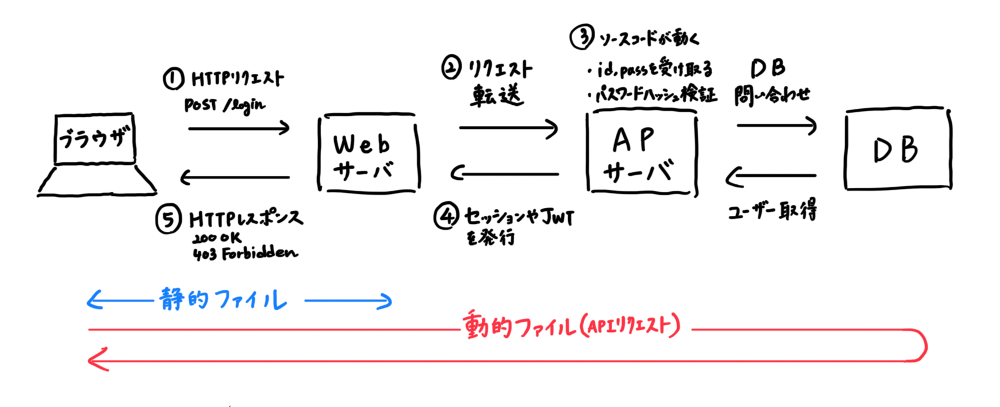
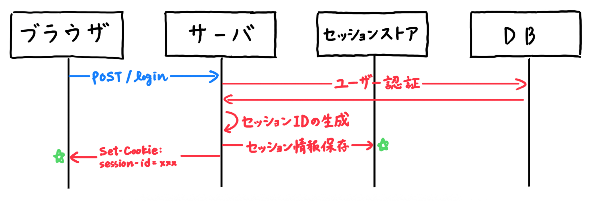
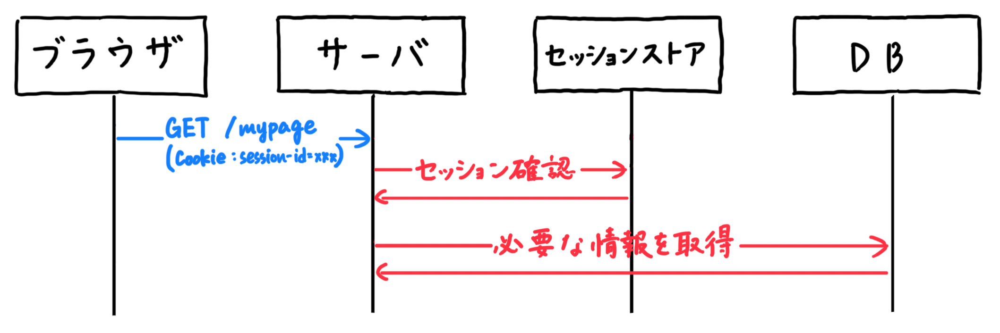
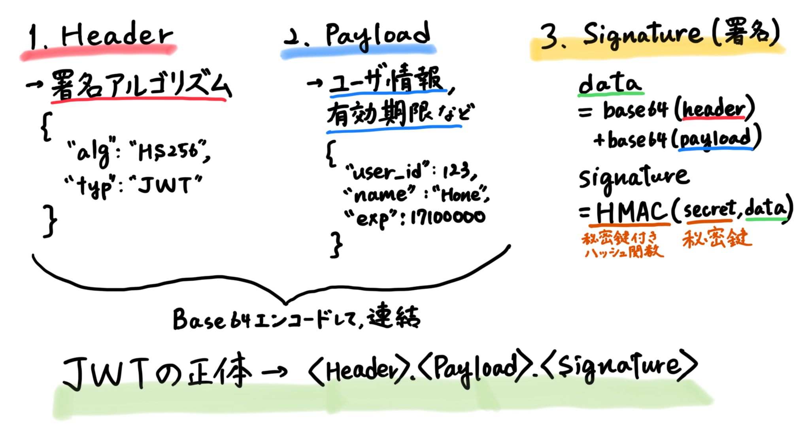

# バックエンド入門1 - ログイン機能を作る

静的サイトだけでなく、ユーザの操作に応じて内容が変わる、**動的なWebアプリケーション**を作ることを目指します。

今回は、ログイン処理の仕組みを理解することを目的とし、PHPで簡易的なログイン機能を実装します。

---

# 目次

---

1. **前提知識**

   1-1. クライアントサーバアーキテクチャ

   1-2. HTTP

   1-3. 認証とセッション管理

2. **PHPの文法**

3. **実装**

   3-1. データベースの設定

   3-2. ログインページ・マイページの作成

   3-3. ログイン処理

4. **演習**

---

## 1. 前提知識

## 1-1. クライアントサーバアーキテクチャ

### 3層クライアントサーバシステム

1990年代、**2層クライアントサーバシステム**が主流だった。

- 「クライアント ↔︎ DBサーバ」の2層
- アプリケーション（ビジネスロジック）が、クライアント側にUIと一体化して組み込まれる

しかし、次のような問題点があった。

- アプリケーション間での相互矛盾
- ビジネスロジックの変更に弱い

そこで、2000年代に、**3層クライアントサーバシステム**が生まれた。

- 「プレゼンテーション層（UI）、ファンクション層/AP層（処理）、データベースアクセス層」に分離
- ビジネスロジックをクライアント側からサーバ側に移行

この **UI・ロジック・データ** という3層アーキテクチャは、2000年代に誕生したWebアプリと相性が良い。

::: tip
**ネイティブアプリ**

ビジネスロジックがクライアント側にある。PCにソフトをインストールし、LANでDBに接続する。ゲームアプリ, Discord（アプリ版）など。

**Webアプリ**

ビジネスロジックがサーバ側にある。1995年頃のブラウザの誕生による（当初は静的HTML専用だった）。Gmail, Xなど。
:::

### 3層Webアーキテクチャ



→ 静的処理（HTML/CSS,画像）はWebサーバが、動的処理はAPサーバが行う。

### 代表的なWebサーバソフト

**Webサーバ**とは・・・

HTTPリクエストを受け取り、レスポンスを返すソフトウェア。

必要なら、リクエストをAPサーバへ転送する**リバースプロキシ**としても動く。

- Apache HTTP Server（1995〜）
  - リクエスト処理は**マルチプロセス型**（1リクエスト＝1プロセス）
  - 高負荷時にリソース消費が大きい

- Nginx（2004〜）
  - リクエスト処理は**イベント駆動型** → 多数の同時接続に強い
  - 静的ファイルの配信が高速
  - HTTPS処理、負荷分散

### WebサーバとAPサーバを繋ぐ規格

1. CGI（Common Gateway Interface）

   昔のWeb。リクエストごとにプログラムを起動するため遅い。

2. FastCGI

   サーバ常駐型。**PHP-FPM**で用いられる。

3. WSGI（Web Server Gateway Interface）

   Python系。

4. ASGI（Asynchronous Server Gateway Interface）

   WSGIの進化版で、非同期処理・WebSocketに対応。FastAPIで用いられる。

### 代表的なAPサーバ

ソースコードを元に、アプリケーションロジックを実行する。

- PHP系

  PHP-FPM（FastCGIプロセスマネージャ）

  その上で、Webフレームワーク（Laravel, Symfonyなど）が動く

- Python系
  - Gunicorn, uWSGI（WSGIサーバ）

    フレームワーク：Django, Flask

  - Uvicorn（ASGIサーバ）

    フレームワーク：FastAPI

- Ruby系

  Puma, Unicorn（Rackサーバ）

  フレームワーク：Rails

現在は、HTTP受付・ロジック実行を一体でやることが多い。

- Node.js（JavaScript のサーバ実行環境）

  フレームワーク：Express, NestJS

- Go

  フレームワーク：Gin, Echo, Fiber

### レンダリング方式

1. **CSR**（Client Side Rendering）
   - リクエストを受けたサーバが、最小限のHTMLとJSを返し、ブラウザでUIを構築する。
   - ブラウザ側ではJSが実行され、**DOM**が組み立てられ、レンダリングされる。
   - 初回表示は遅い（∵ JS実行待ち）が、その後は速い（∵ 画面遷移はJSで完結）。
   - ReactやVueなど。

2. **SSR**（Server Side Rendering）
   - リクエストを受けたサーバがHTMLを作成し、クライアントに返却する。

現在はこれらを組み合わせ、①初回表示を高速化、②以降のインタラクティブ性（操作性）の向上を両立している。

1. SSRでHTMLを表示（速い）
2. ブラウザがJSを読み込む
3. そこでJSがDOMと結びつく（Hydration）
4. 以降はCSR的に動く

::: tip
**Hydration**

サーバでSSRで生成されたHTMLに対して、ブラウザ側のJavaScriptがイベント処理などを結びつけ、インタラクティブにするプロセス。

:::

### 代表的なDBサーバ

1. **RDB**（リレーショナルデータベース）

   垂直スケール。標準の使用言語は**SQL**で、各DBが独自機能・文法を足している。
   - MySQL：**LAMP**構成（Linux, Apache, MySQL, PHP）の定番。
   - PostgreSQL：データ型、拡張機能が豊富
   - Oracle Database
   - SQLite：**サーバ不要**の組み込みDB。データは単一ファイル。

2. **NoSQL**

   水平スケール。`key: value`型やJSON型などのドキュメントでデータを管理。
   - MongoDB
   - Redis：高速アクセス → キャッシュに使われる。

::: tip

**垂直スケール**

1台のDBサーバを強くする（CPU・メモリ↑）。

**水平スケール**

DBを複数台設けて、データを分散させて保存する（負荷分散）。

:::

### （補足）サーバはどこにある？

1. **オンプレミス**

   自分たちの組織で物理サーバを持つ（@会社のサーバ室）。セキュリティポリシーを細かく制御できる。

2. **クラウド**（AWS, Microsoft Azure, Google Cloud）

   物理サーバは、クラウド事業者のデータセンターにある。ユーザは、その物理サーバを分割して作られる仮想サーバ（VM）を借りる。

   ソースコードは、APサーバのマシンに置かれる。

   社内ネットワーク→インターネット→クラウドのネットワーク

## 1-2. HTTP（Hyper Text Transfer Protocol）

### 定義

WebサーバとWebクライアント（ブラウザ）間でWeb情報をやり取りするための通信プロトコル。1通信＝リクエストとレスポンスの1往復。**ステートレス**（＝前の状態を覚えない）なプロトコル。

::: tip
プロトコルとは、コンピュータ同士が情報をやり取りする際に必要となる規則。
:::

ブラウザで `https://example.com/index.html` にアクセスする際、以下のようなリクエストがサーバに送られている。

```
GET /index.html HTTP/1.1
Host: example.com
User-Agent: Mozilla/5.0 (Macintosh; Intel Mac OS X 13_0)
Accept: text/html,application/xhtml+xml
Accept-Language: ja,en-US;q=0.9
Accept-Encoding: gzip, deflate, br
Connection: keep-alive
```

これに対し、サーバは以下のようなレスポンスをクライアントに返す。

```
HTTP/1.1 200 OK
Content-Type: text/html; charset=UTF-8
Content-Length: 137
Date: Mon, 23 Mar 2026 04:00:00 GMT
Server: nginx

<!DOCTYPE html>
<html>
  <head>
    <title>Test</title>
  </head>
  <body>
    Hello World
  </body>
</html>
```

レスポンスは、以下の3つで構成される。

1. ステータスライン（`HTTP/1.1 200 OK`）
2. ヘッダ
3. ボディ（HTMLなどの本体データ）

ブラウザがこれを読み取り、レンダリングが行われる。

### HTTPリクエストメソッド

- `GET`：指定したリソースの表現をリクエストする。データの取得のみ。

- `HEAD`：レスポンス本文なし、ヘッダのみのGET

- `POST`：指定したリソースに実体を送信する

- `PUT`：対象リソースの現在の表現全体を、リクエストのコンテンツで置き換える

- `DELETE`：指定したリソースを削除

### HTTPレスポンスのステータスコード

1. 情報レスポンス (100 – 199)
2. 成功レスポンス (200 – 299)
3. リダイレクトメッセージ (300 – 399)
4. クライアントエラーレスポンス (400 – 499)
5. サーバーエラーレスポンス (500 – 599)

ex.

- 200 OK：リクエスト成功
- 404 Not Found：リクエストされたリソースを発見できない
- 500 Internal Server Error：サーバ側で処理エラー

## 1-3. 認証とセッション管理

### 認証とは

ユーザなどのエンティティが主張する身元を検証するプロセス。

なりすまし・不正アクセスを防ぐ。

### 認証要素

- 知識要素（パスワード、秘密の質問）
- 所持要素（電話番号、認証アプリのPINコード）
- 生体要素（指紋、顔、虹彩）

これらを2種類以上組み合わせたものを、**多要素認証**（MFA）という。

### 認証と認可

- 認証：あなたは誰？（Authentication）
- 認可：何をして良いか？（Authorization）

case1. 分離させる

> ログイン時 → ID/パスワードで**認証**する
>
> ログイン後 → 各API（`/admin`や`/api/payment`など）アクセス時に**認可**を行う

case2. 同時に行う

> ログイン時にロールを付与
>
> `permissions: ["read", "write"]`などをセッションやJWT（後述）に含める

### Cookieによるセッション管理

::: tip
セッション ＝ ログインしてからログアウトするまでの、一連の通信のまとまり
:::

HTTPは**ステートレス**なプロトコル。リクエストとレスポンスの1往復で完結する仕様のため、前後の通信から情報を引き継ぐことはできない。

ステートレスの欠点 → **ログイン状態を保持できない！**

Webサーバとクライアント間の状態を管理する、**Cookie**という仕組みが生まれた。

> 1994年、ネットスケープコミュニケーションズ社のエンジニアであるルー・モントゥリ（Lou Montulli）氏が、ユーザーの訪問情報を識別する目的で発明した。

Cookieでは、Webサーバが保存しておきたい情報を生成し、HTTPヘッダを使ってブラウザ（クライアント）に送信する。ブラウザはこれを保存し、以降の通信で、必要に応じてサーバに送信する。

### ログイン認証の2種類

1. セッションベース（↑のセッションとは違う意味）

   ステートフル＝**サーバ**が認証情報（セッション）を保存する。

   サーバが、入場者リストを持っている。

2. トークンベース

   ステートレス＝**クライアント**がトークンを保存する。

   各クライアントが、署名つきで偽造できない入場券を持っている。

### セッションベース認証

認証時、サーバが**セッションID**を発行し、サーバ側、クライアント側の双方でセッション情報を保存し、以降のリクエストではそれを照合する。

- サーバ側：セッションストア（∴ ステートフル）

- クライアント側：ブラウザのCookie



認証済みのリクエストは、次図のように処理される。



**サーバ側**での、セッションIDのタイムアウトには、2種類の方式がある。

1. **アイドルタイムアウト**

   一定時間操作がなかったらログアウトする。

2. **絶対タイムアウト**

   「ログイン後 xxx時間後に強制ログアウト」がAPロジックで定義されている。

同時に、**クライアント側**でもCookieのタイムアウトが起こる。

`Set-Cookie: session_id=abc123; Max-Age=3600`（このCookieを何秒間保存するか）

`Set-Cookie: session_id=abc; Expires=Wed, 09 Jun 2026 10:18:14 GMT`

のように定義されている。

::: warning
ブラウザにCookieが残っていても、サーバ側でセッションが切れていたら、再ログインが必要。
:::

### トークンベース認証

ログイン後、サーバは**トークン**をクライアントに発行し、以降のリクエストでは、それを送って本人確認する。

- サーバ側：認証情報を持たない（∴ ステートレス）

- クライアント側：ブラウザの localStorage や Cookie

最も有名なトークンの形式は、**JWT**（JSON Web Token）。




### CSRFトークン

**CSRF（Cross-Site Request Forgeries）** 攻撃に対するセキュリティ対策。

- 脆弱性

  罠サイトからのリクエストでも、ログインユーザーのセッションIDが付いていれば、本人からのリクエストだと見なされてしまう（なりすまし）。

- 成立条件
  1. ユーザーがログイン中であること
  2. Cookie認証を使っていること

ex.

> 被害者がAmazonにログインした状態で、Amazonで100億円の買い物をするPOSTリクエストが自動送信される罠サイトを開いてしまう

これを悪用し、セッション固定攻撃（ログイン状態を固定する）、強制送金、アカウント乗っ取りなどが可能。

- 問題の原因

  POST送信時、**ブラウザが自動的に**、リクエストにCookieを含めること。

- 解決策
  1. `/login`でサーバがランダムなトークン（文字列）を生成し、セッションに保存

  2. HTMLのフォーム内にも埋め込む

     ```html
     <form action="/transfer" method="POST">
       <input type="hidden" name="csrf_token" value="X8sk3Kdf" />
     </form>
     ```

  3. POST送信時、そのトークンも一緒に送信される

  4. サーバで照合

攻撃者は正しいCSRFトークンを取得できないため、不正なリクエストは`403 Forbidden`で拒否される（理由は次ページ）。

### 同一オリジンポリシー（Same-Origin Policy）

1990年代後半、ブラウザにJavaScriptが導入されたことで生まれた仕様。**JSは、同じオリジンのデータしか読めない。**

::: tip
オリジン = スキーム（プロトコル）+ ホスト + ポート
:::

> `https://example.com/a`のURLに対し、`https://example.com/b`は同一オリジンだが、`https://example.com:8080`や`https://test.com`は異なるオリジン。

罠サイトから正規サイトのHTMLを読むことはできないので、攻撃者は

```
POST /login
csrf_token=?????
```

のリクエストを作ることはできない。

後に、SOPを部分的に解除する**CORS**（Cross-Origin Resource Sharing）も生まれた。

---

## 2. PHPの文法

## 2-1. オブジェクト指向（Object-Oriented）

- 3大要素
  - **カプセル化**

    データと処理を一つにまとめ、内部の詳細を外部から隠蔽する

  - **インヘリタンス（継承）**

    スーパークラス（親）で定義した属性やメソッドをサブクラス（子）が使える

  - **ポリモーフィズム（多態性）**

    同じ操作で、オブジェクトごとに結果が異なる

- クラスとインスタンス

  類似オブジェクトに共通する性質を抜き出し、属性（変数）やメソッド（関数）を一般化して、**クラス**を定義する。

  それを使用して生成した実体（具体値を持ったオブジェクト）が**インスタンス**。

- PHP, Java, C#はクラスベース ↔︎ JavaScriptはプロトタイプベース

## 2-2. 基本

- 変数は `$変数名` で表記

- `echo` 出力する

- 文字列は `.` で連結する（`echo "Hello " . $name;`）

- `::` クラス自身（インスタンス化する前）の静的メンバーにアクセスする

- `->` オブジェクト実体（インスタンス）のプロパティやメソッドにアクセスする

- `=>` 配列のkeyとvalueを結びつける

  マップ（辞書）は**連想配列** `$users = ["name" => "xxx", ...]`

- ループ処理 `foreach (<配列名> as $value) { 処理 }`

  インデックスも取る `foreach (<配列名> as $key => $value) { 処理 }`

- 関数の宣言 `function <関数名>(引数): 戻り値の型 { 処理 }`

- 三項演算子 `条件 ? trueのとき : falseのとき`（`echo ($score >= 60) ? "pass" : "fail";`）

- `===` 型も値も比較（これを使う）

  `==` 型変換してから比較（`0 == "apple"`→true）

- `__XXX__` マジック定数/メソッド（`__FILE__`, `__DIR__`, `__LINE__`, ...）

- `require <ファイル名>` 読み込んだファイルのPHPコードを実行する

  `require_once` 同じファイルを複数回読み込まないようにする

- `file_get_contents(<ファイル名>)` ファイルの中身を文字列として取得する

- `exit()`, `die()`プログラムを終了し、それ以降は実行しない

## 2-3. クラス関連

- `$xxx = new <クラス名>(引数);` でインスタンスオブジェクトを生成

  引数は、クラスの**コンストラクタ**（オブジェクト生成時に自動実行されるメソッド、`__construct`と表記）に渡る

- クラスのアクセスを制御する修飾子（変数・メソッドの前につける）

  | 修飾子      | 同じクラス | 子クラス | 外部 |
  | ----------- | ---------- | -------- | ---- |
  | `public`    | ○          | ○        | ○    |
  | `protected` | ○          | ○        | ×    |
  | `private`   | ○          | ×        | ×    |

  データ（変数）はprivate、操作（メソッド）はpublicにする（**カプセル化**）。

## 2-4. Web開発で頻出

- null合体演算子`??`（`$a ?? $b;` aがnullならb）

- null合体代入`??=`（`$a ??= $b;` aがnullのときだけbを代入）

- superglobals（すべてのスコープで使用できる変数）

  | 変数        | 意味          |
  | ----------- | ------------- |
  | `$_GET`     | URLパラメータ |
  | `$_POST`    | POSTデータ    |
  | `$_SESSION` | セッション    |
  | `$_COOKIE`  | クッキー      |
  | `$_SERVER`  | サーバ情報    |

- `empty($a)` aが空なら真（バリデーションで使用）

- `filter_input(<リクエストメソッド名>, <キー>, <変換法>)` HTTPリクエストから値を取得する

- `header(<リクエストに含めるヘッダ>)`生のHTTPヘッダを送信する

  ex. header関数でリダイレクトする例

  ```php
  header("Location: ./test2.php"); // test2.phpへリダイレクト
  exit();
  ```

- `session_start();` セッション管理（`session_id`の生成・Cookieおよびセッションストアに保存）を実行する

---

## 3. 実装

PHP / HTML / CSS で簡易的なログイン機能を実装する。

1. `$ git clone https://github.com/74rina/Login.git`

2. アプリケーションのビルド
   1. `$ php init_db.php`（DBのテーブルを作成・シードデータを投入）
   2. `$ php -S localhost:8000`（PHPのwebサーバを起動）

（Dockerを使う場合・・・2は行わず、`$ docker compose up --build`）

3. ブラウザで、`http://localhost:8000/login.php` にアクセス

4. `user@example.com` / `password123` でログイン

※ `$`はターミナル上で実行するコマンド

※ `git`や`docker`の講習は次回以降！お楽しみに！

### ディレクトリ構造

```

login
├── auth.php（マイページ上のガード）
├── config.php（DBの接続設定）
├── data
│   └── app.sqlite
├── init_db.php（テーブルの作成）
├── login_process.php（ログイン処理）
├── login.php
├── logout.php（ログアウト処理）
├── mypage.php
├── session.php（セッションIDの生成）
└── style.css

```

## 3-1. データベースの設定

- DB接続を設定する`config.php`を作成
  - DBに接続するための関数`getPdo()`

- DBを初期化する`init.php`を作成
  - `users`テーブルの作成
  - シードデータの投入

  すでにDBがあれば実行しないので、例外処理の**try-catch文**で実装する。

  ```php
  try {
     危険そうな処理
  } catch (Exception $e) {
     エラー時の処理
  }
  ```

### PDOクラス

PHPでDBに接続＋操作するための共通インタフェースである**PDO**（PHP Data Objects）クラスを用いる。インスタンス`$pdo`を生成し、そのメソッドでDBを操作する。

```php
$pdo = new PDO(
    "mysql:host=localhost;dbname=test", // 接続先
    "user", // DBユーザ
    "password" // DBパスワード
);
```

第一引数のDSN（Data Source Name）は、次のように環境変数（後述）から値を取り出して書くことが多い。

```php
$dsn = "mysql:host=".$_ENV['DB_HOST'].";dbname=".$_ENV['DB_NAME'];
```

PDOクラスのメソッドは以下。
| メソッド | 役割 | 例 |
| -------------------- | --------------------------- | ------------------------------------- |
| `__construct()` | DB接続を作る | `$pdo = new PDO($dsn,$user,$pass);` |
| `prepare()` | SQLを準備（プリペアドステートメント） | `$stmt = $pdo->prepare($sql);` |
| `query()` | SQLを直接実行（SELECTなど） | `$pdo->query("SELECT * FROM users");` |
| `exec()` | SQL実行（INSERT/UPDATE/DELETE） | `$pdo->exec($sql);` |
| `beginTransaction()` | トランザクション開始 | `$pdo->beginTransaction();` |
| `commit()` | トランザクション確定 | `$pdo->commit();` |
| `rollBack()` | トランザクション取り消し | `$pdo->rollBack();` |
| `lastInsertId()` | 最後にINSERTしたID取得 | `$pdo->lastInsertId();` |
| `setAttribute()` | PDO設定変更 | `$pdo->setAttribute(...);` |
| `getAttribute()` | PDO設定取得 | `$pdo->getAttribute(...);` |
| `errorCode()` | エラーコード取得 | `$pdo->errorCode();` |
| `errorInfo()` | エラー詳細取得 | `$pdo->errorInfo();` |
| `quote()` | SQL用に文字列をエスケープ | `$pdo->quote($str);` |

### プリペアドステートメント

`$query = "SELECT * FROM users WHERE name = '$name'";` でユーザ入力`$name`を受け付ける際に、正規のユーザ名ではなく、`' OR 1=1 --`が入力されると、

`SELECT * FROM users WHERE name = '' OR 1=1 --'`

で全ユーザが取得されてしまう（∵ 1=1は常に真）。→ **SQLインジェクション**

これを防ぐために、`?`プレースホルダを用いて、**SQL実行とデータ代入を分離**する。

```php
$stmt = $pdo->prepare(
  "SELECT * FROM users WHERE name = ?"
);
$stmt->execute([$name]);
```

### 環境変数

秘密情報（パスワードなど）は、プログラムのコードに直接書く（＝**ハードコーディング**）ことはせず、環境変数として別ファイル（`.env`）に書く。

`.env`ファイルの例（開発用）

```
DB_HOST=localhost
DB_USER=admin
SECRET_KEY=abc123
PORT=3000
```

このファイルは、GitHub上で公開しない（`.gitignore`で設定）。チーム開発では、別の安全な方法で共有する。

## 3-2. ログインページ・マイページの作成

`login.php`でログイン成功 → `mypage.php`に遷移（実際のログイン処理や認証は切り分ける）。

今回は、内部にHTMLを書き、**フロントエンド**を構築する。

> Webサーバがブラウザからのリクエストを受信し、APサーバに転送後、
>
> APサーバ（PHP）は、タグ`<?php ... ?>`を見つけて中身を実行し、それ以外のHTML/CSSはそのまま出力する。
>
> ブラウザは、受け取った文字列をHTMLとして解釈し、レンダリングする。

## 3-3. ログイン処理

実際のログイン処理を`login_process.php`で実装する。

- ログインページを踏んだら、まず**CSRFトークン**を生成

- CSRFトークンが合っているか検証

  ```php
  // login_process.php
  $token = $_POST['csrf_token'] ?? '';
  if (!hash_equals($_SESSION['csrf_token'], $token)) { ... }
  ```

- バリデーション（＝入力の空文字チェック）

- DBから値を取得し、ユーザ存在確認＋パスワードの検証

- ↑を突破したら、①セッションIDの作成　②ユーザ情報をセッションに保存

CSRFトークンは、`session.php`を一回実行することで生成される。

```php
// session.php
$_SESSION['csrf_token'] = bin2hex(random_bytes(32));
```

未ログイン状態でマイページにアクセスしたときのガードは、`auth.php`に実装する。

```php
// auth.php
function requireLogin(): void
{
    if (empty($_SESSION['user_id'])) {
        $_SESSION['flash_error'] = 'ログインが必要です。';
        header('Location: login.php');
        exit;
    }
}
```

### ハッシュ化

特定の計算方法に基づき、元データをハッシュ値（不規則な固定長文字列）に置換し、データを保護すること（≠ 暗号化）。

**ハッシュ関数**：任意の入力データをハッシュ値に変換する関数（以下の特徴をもつ）。

- 固定長の出力（ex. SHA-256 ＝ 256ビットのハッシュ値を生成するハッシュ関数）
- 一方向性（ハッシュ値から元のデータを復元できない）
- Avalanche効果（入力が少し変わるだけで出力が大きく異なる）

**レインボーテーブル**：平文とハッシュ値の対応表（ソルトで無効化）

**ソルト**：ハッシュ化する前に、平文に足すランダムな文字列

**レインボーテーブル攻撃**：攻撃者が大量のパスワードをハッシュ化し、同じハッシュ値がレインボーテーブルに存在した場合に、その平文パスワードが盗まれる。

Webの認証でも、ハッシュ化が用いられる。PHPでは以下の関数を使用する。

- パスワード保存時
  平文パスワードをハッシュ化し、ソルトも自動生成

  ```php
  // init_db.php
  $hash = password_hash($password, PASSWORD_DEFAULT);
  ```

- パスワード検証時
  内部で`bcrypt`などのアルゴリズムが用いられている

  ```php
  // login_process.php
  if (!$user || !password_verify($password, $user['password_hash'])) { ... }
  ```

---

# 4. 演習

### Q. ログアウト処理を作ろう！

実装のヒント：
ログアウトとは？ → セッションIDを無効化すること。

### こたえ（笑）

```php
// logout.php
<?php
require_once __DIR__ . '/session.php';

// セッション変数を空にする
$_SESSION = [];

// セッションクッキーも無効化する
if (ini_get('session.use_cookies')) {
    $params = session_get_cookie_params();
    setcookie(
        session_name(),
        '',
        time() - 42000,
        $params['path'],
        $params['domain'] ?? '',
        $params['secure'],
        $params['httponly']
    );
}

// サーバー側のセッション情報を破棄
session_destroy();

// ログアウト後はログイン画面へ
session_start();
$_SESSION['flash_success'] = 'ログアウトしました。';
header('Location: login.php');
exit;
```

マイページの`main`内にログアウトボタンを追加

```php
// mypage.php
...
<div class="actions">
  <a class="btn-link" href="logout.php">ログアウト</a>
</div>
...
```

---

## お疲れさまでした！

実際の開発ではWebフレームワークを利用するため、今回学んだ内容（認証など）を開発中に意識する場面は少ないかもしれません。それでも、ログイン時の裏側の仕組みを理解しておくことは、より良い実装やデバッグのために、重要だと考えます！

## 参考文献

- Qiita「JWT認証の流れを理解する」https://qiita.com/asagohan2301/items/cef8bcb969fef9064a5c
