# バックエンド入門2 - 掲示板を作る

[参考リポジトリ](https://github.com/74rina/Bulletin_Board)

バックエンド入門1では、ログイン処理を実装しながら、認証やセッション管理の仕組みを理解しました。

入門2では、掲示板のバックエンドを実装しながら、動的サイトの主役である API・DB の設計について学びます。

---

# 目次

---

1. **前提知識**

   1-1. DBについて

   1-2. API設計

2. **SQLの文法**

   2-1. DB用語

   2-2. SQLクエリを書く

3. **実装**

   3-1. 環境構築

   3-2. DB設計

   3-3. APIエンドポイントの作成

4. **挙動確認**

   4-1. CLIでDBに接続する

   4-2. GUIでDBに接続する

   4-3. curlコマンド

   4-4. Postmanでリクエスト送信

---

## 1. 前提知識

## 1-1. DBについて

### DB（データベース）とは

データを体系的に整理して蓄積したもの。**DBモデル**とは、「データをどのような構造で保存するかの設計思想」であり、代表例は以下（年代順）。

| DBモデル          | 構造               | 使用例                                   |
| ----------------- | ------------------ | ---------------------------------------- |
| Hierarchical DB   | ツリー             | IBM Information Management System (1968) |
| Network DB        | グラフ（親が複数） | メインフレーム時代のIDMS                 |
| **Relational DB** | テーブル           | 現代のWebで利用。MySQL, PostgreSQL       |
| NoSQL             | 用途別             | キャッシュなどに利用。Redis, MongoDB     |

### 3層スキーマアーキテクチャ

DBは、そのモデルに拘らず、**表現・ロジック・データ保存** という3層を持つ。この3層を独立させることで、局所的な変更に強いシステムを実現できる。

| 層           | 役割                 | 開発でやること                                     |
| ------------ | -------------------- | -------------------------------------------------- |
| 外部スキーマ | ユーザーごとの見え方 | APIエンドポイント・SQLクエリの設計                 |
| 概念スキーマ | DB全体の設計         | ER図・テーブルの設計                               |
| 内部スキーマ | 実際の保存方法       | インデックスやストレージの設計（基本はDBに任せる） |

### RDB（Relational DataBase）

現代のWebで用いられているDBモデル。**関係モデル**という概念を、コンピュータ上に実装したもの。

関係モデル（Relational Model）においては、

- データは表（テーブル）で表現される
- 行＝タプル、列＝属性
- **主キー** ＝ この値によって、どの行か一意に定まる（`id`カラムなど）

という規則がある。

### 正規化

データの重複を減らしたり、不整合を防いだりするために、テーブルを分けること。
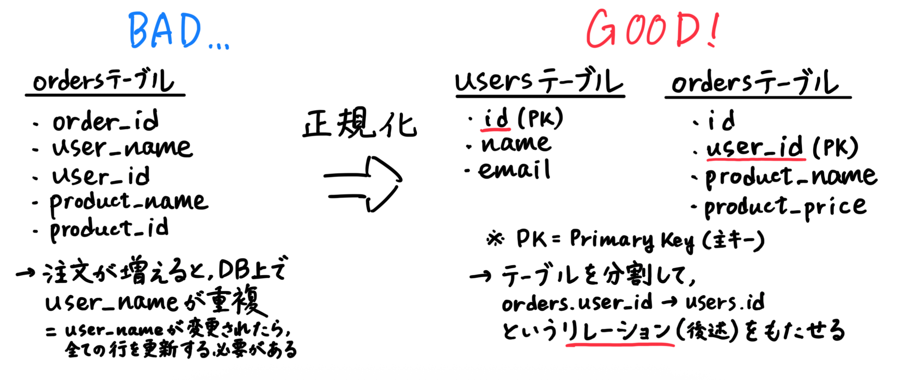

### ER図（Entity Relationship Diagram）

テーブル同士の関係を視覚的に表現したもの。

- Entity（エンティティ）：テーブル
- Relationship（リレーション）：テーブル間の関係

ex.) `User ---< Post`：ユーザー1人に対して複数の投稿が紐づく（1対多）

### DBのリレーション

テーブル間のリレーションをDB上で表現するために、**外部キー**を用いる。

ex.) `posts.user_id = users.id`

| 種類                      | 意味                                         | 例                        | 設計のポイント                          |
| ------------------------- | -------------------------------------------- | ------------------------- | --------------------------------------- |
| **1対1 (One-to-One)**     | 1つのデータに対して、対応するデータが1つだけ | ユーザー ↔ プロフィール   | どちらかに外部キーを持たせる            |
| **1対多 (One-to-Many)**   | 1つのデータに対して、複数のデータが紐づく    | ユーザー → 投稿           | 「多」の側に外部キーを持たせる          |
| **多対多 (Many-to-Many)** | 複数のデータ同士が互いに複数紐づく           | ユーザー ↔ いいねした投稿 | **中間テーブル**に外部キーを2つ持たせる |

## 1-2. API設計

### API（Application Programming Interface）とは

異なるプログラム間を繋ぎ、片方の機能をもう片方で呼び出す仕組み。APIの代表的な設計思想は以下。

1. **REST API**（Representational State Transfer API）：現代のWebAPIの主流。

2. RPC（Remote Procedure Call）：データを関数で操作する。

3. GraphQL：クライアントが、データを直接指定する。

### REST API

2000年に Roy Fielding 氏が博士論文で提唱した、APIの設計思想。
6大設計原則と**リソース指向**（後述）から成る。

- **RESTの6原則** ＝ REST API の前提となるWebアーキテクチャ
  1.  Client - Server（クライアントのリクエスト ↔︎ サーバのレスポンス）
  2.  Stateless（サーバは状態を保持しない）
  3.  Cacheable（リソースはキャッシュ可能 → サーバの負荷↓）
  4.  Uniform Interface（リソースへの操作方法を統一する ← CRUD操作）
  5.  Layered System（階層構造にする → 拡張性↑）
  6.  Code on Demand（クライアントがコードを実行・送信）

### リソース指向（Resource Oriented Design）

RESTでは、サーバを「**リソースの集合**」とみなし、それを**URL**で表現する。それに対する操作は、HTTPリクエストメソッドで表す。

- URLは全て名詞（`/users`, `/posts`, `/users/honenashi/profile`）
- URLは複数形
- レスポンスは**JSON形式**。
  ```JSON
  {
  "id": 1,
  "title": "Hello",
  "author": "Honenashi Chicken"
  }
  ```

### CRUD操作

APIエンドポイントを用いて、**HTTPメソッド**＋**リソース名** でDBを操作すること。

- **C**（Create）：データを**作成**する

  `POST /messages`（メッセージを投稿する）

- **R**（Read）：データを**取得**する

  `GET /users`（ユーザー一覧を取得）

  `GET /products/123`（123番の商品情報を取得）

- **U**（Update）：データを**更新**する

  `PUT /products/123`（123番の商品情報を更新）

- **D**（Delete）：データを**削除**する

  `DELETE /messages/123`（123番のメッセージを削除）

---

## 2. SQLの文法

SQL（Structured Query Language）とは、RDBMS（リレーショナルデータベース管理システム）に対し、データを格納・操作・管理するための、ISOで国際標準化された言語。

::: tip
**ISO**（International Organization for Standardization）

製品やサービスの品質・安全性に関する世界共通のルール「ISO規格」を定める、スイスのジュネーブに本部を置く非政府組織。

非常口マーク、クレカのサイズ、組織の業務管理のルールなど。

:::

## 2-1. DB用語

- **データベース**

  アプリで使う全てのデータ（テーブル）を保管する場所。

- **テーブル**

  実際にデータが入っている表。行と列で構成される。

- **カラム**

  テーブルの列。`users`テーブルの `id`, `name`, `password` とか。

- **レコード**

  テーブルの行。

  | id  | username |
  | --- | -------- |
  | 1   | taro     |

## 2-2. SQLクエリを書く

### データを取得する

```SQL
SELECT * FROM users;
```

- `*`は「すべて」を表す

- 条件は`WHERE`句で絞る（`SELECT * FROM users WHERE id = 1;`）

### データを追加する

```SQL
INSERT INTO users (username, password)
VALUES ('honenashi', 'pass1234');
```

### データを更新する

```SQL
UPDATE users
SET username = 'honetsuki'
WHERE id = 1;
```

### データを削除する

```SQL
DELETE FROM users
WHERE id = 1;
```

---

## 3. 実装

## 3-1. 環境構築

PHPで、掲示板のバックエンドを実装するにあたり、①PHPコマンド、②MySQLコマンドのインストールが必要。

### 使用するコマンドのインストール

::: warning

ローカル環境を汚したくない方は、Docker を使用しても構いません。別途相談してください。

:::

- Windows の方

  コマンドプロンプト > `wsl` で、以下を実行。

  ```
  $ sudo apt update
  $ sudo apt install php
  $ sudo apt install mysql-server
  $ sudo service mysql start
  $ sudo apt intall php-mysql
  ```

  - 確認

    `$ php -m | grep pdo`

    で、`pdo_mysql` が表示されない場合は、

    `$ sudo phpenmod pdo_mysql`

    を実行する。

- Mac の方

  ターミナルで、以下を実行。

  ```
  $ brew install php
  $ brew install mysql
  $ brew services start mysql
  ```

### 起動手順

1. `$ git clone https://github.com/74rina/Bulletin_Board.git`

2. MySQLのDBサーバに `schema.sql` を流す

   `$ sudo mysql < schema.sql`

3. PHPのWebサーバを起動

   `$ php -S localhost:8000`

4. 以降の挙動確認は後述

## 3-2. DB設計

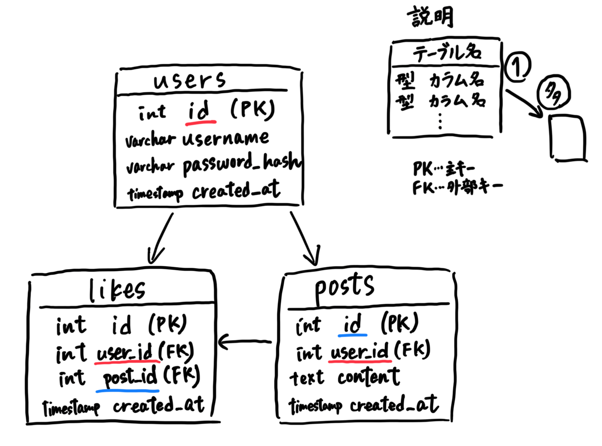

上図のようにテーブルを設計するためのSQLクエリが、`schema.sql`内に書かれている。

```sql
-- MySQL schema for the simple bulletin board
CREATE DATABASE IF NOT EXISTS bulletin_board CHARACTER SET utf8mb4 COLLATE utf8mb4_unicode_ci;
USE bulletin_board;

-- Users テーブル
CREATE TABLE IF NOT EXISTS users (
    id INT AUTO_INCREMENT PRIMARY KEY,
    username VARCHAR(50) NOT NULL UNIQUE,
    password_hash VARCHAR(255) NOT NULL,
    created_at TIMESTAMP DEFAULT CURRENT_TIMESTAMP
);

-- Posts テーブル
CREATE TABLE IF NOT EXISTS posts (
    id INT AUTO_INCREMENT PRIMARY KEY,
    user_id INT NOT NULL,
    content TEXT NOT NULL,
    created_at TIMESTAMP DEFAULT CURRENT_TIMESTAMP,
    FOREIGN KEY (user_id) REFERENCES users(id) ON DELETE CASCADE
);

-- Likes テーブル
CREATE TABLE IF NOT EXISTS likes (
    id INT AUTO_INCREMENT PRIMARY KEY,
    user_id INT NOT NULL,
    post_id INT NOT NULL,
    created_at TIMESTAMP DEFAULT CURRENT_TIMESTAMP,
    UNIQUE KEY uniq_user_post (user_id, post_id),
    FOREIGN KEY (user_id) REFERENCES users(id) ON DELETE CASCADE,
    FOREIGN KEY (post_id) REFERENCES posts(id) ON DELETE CASCADE
);
```

## 3-3. APIエンドポイントの作成

**APIエンドポイント**とは、WebAPIにおいて、クライアントがサーバ上のリソースにアクセスするための窓口となるURLのこと。今回は、

- ユーザ新規登録 `POST /register`
- ログイン `POST /login`
- ログアウト `POST /logout`
- 投稿を全件取得する `GET /posts`
- 投稿する `POST /posts`
- いいねする `POST /likes`

のエンドポイントを、`index.php`内に作成する。

1. ユーザ新規登録のエンドポイント

   ```php
   if ($path === '/register' && $method === 'POST') {
       $data = read_json_body();
       $username = trim($data['username'] ?? '');
       $password = $data['password'] ?? '';

       if ($username === '' || $password === '') {
           json_response(400, ['error' => 'username と password は必須です']);
       }

       $hash = password_hash($password, PASSWORD_DEFAULT);
       $stmt = $pdo->prepare('INSERT INTO users (username, password_hash) VALUES (?, ?)');
       try {
           $stmt->execute([$username, $hash]);
           $_SESSION['user_id'] = (int)$pdo->lastInsertId();
           $_SESSION['username'] = $username;
           json_response(201, ['message' => 'registered', 'user' => ['id' => $_SESSION['user_id'], 'username' => $username]]);
       } catch (PDOException $e) {
           json_response(409, ['error' => 'username が既に存在します']);
       }
   }
   ```

2. ログインのエンドポイント

   ```php
   if ($path === '/login' && $method === 'POST') {
       $data = read_json_body();
       $username = trim($data['username'] ?? '');
       $password = $data['password'] ?? '';
       $stmt = $pdo->prepare('SELECT id, password_hash FROM users WHERE username = ?');
       $stmt->execute([$username]);
       $user = $stmt->fetch();

       if ($user && password_verify($password, $user['password_hash'])) {
           $_SESSION['user_id'] = (int)$user['id'];
           $_SESSION['username'] = $username;
           json_response(200, ['message' => 'logged_in', 'user' => ['id' => $_SESSION['user_id'], 'username' => $username]]);
       }
       json_response(401, ['error' => 'ログインに失敗しました']);
   }
   ```

3. ログアウトのエンドポイント

   ```php
   if ($path === '/logout' && $method === 'POST') {
       session_destroy();
       json_response(200, ['message' => 'logged_out']);
   }
   ```

---

## 4. 挙動確認

ここでいう挙動確認とは、「DBに対してCRUD操作が正しく行えるかを確かめること」である。方法としては、次の2種類。

1. **DBを直接操作して確認する方法**

   1-1. ターミナルでDBに接続し、その中でSQLクエリを書く（CLI）

   1-2. TablePlusなどのアプリでDBに接続する（GUI）

   これは、**DBそのものに直接アクセス**して、データを確認・操作するもの。

2. **API経由で確認する方法**

   2-1. ターミナルで`$curl`コマンドを打つ（CLI）

   2-2. Postmanなどのアプリでリクエストを投げる（GUI）

   これは、**作成したAPIエンドポイントが正常に動作しているか**を確認するもの。

::: warning

今回は簡単のため、APIを叩く**フロントエンド**（UI）は構築していない。

ただし、実際の開発でも、作成したAPIエンドポイントが正しく動くか、また不具合が起きていないかを確認するために、curl や Postman を用いて動作確認やトラブルシューティングを行うことは多い。
:::

## 4-1. CLIでDBに接続する

Windowsはコマンドプロンプト、Macはターミナルで、DBサーバ内のシェルに接続し、CLIでDBを操作できる。

入り方は、

**`$ mysql -u <DBユーザ名> -p <パスワード>`**

今回は、`$ mysql -u bb_user -p` の実行後パスワードを入力し、DBサーバの中に入る。

中のシェルで使用するコマンドは、次の通り。

1. `show databases;`

   サーバ内にあるDB一覧を表示する。

2. `use <DB名>;`

   使用するDBを選択する。

3. `show tables;`

   選択したDBが持つテーブル一覧を表示する。

4. `SELECT * FROM <テーブル名>`

   など、任意のSQLクエリを実行できる（`2. SQLの文法`を参照）。

一連の流れは下写真を参照。

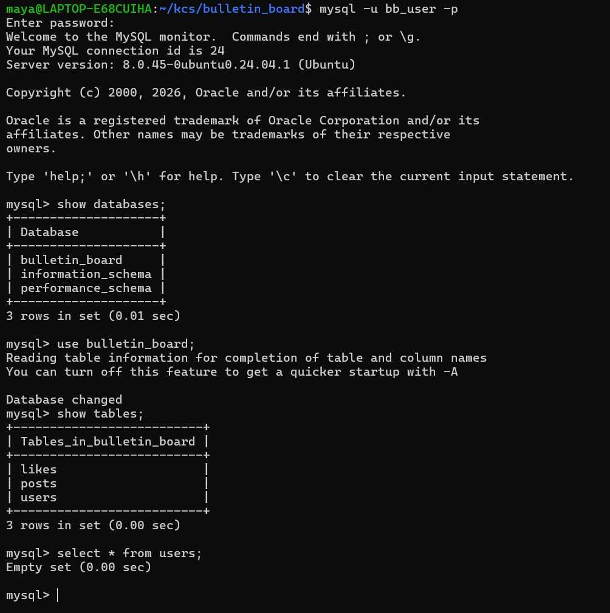

## 4-2. GUIでDBに接続する

**TablePlus** などのアプリを用いてDBに接続し、GUIで容易にDBを操作できる。

1. https://tableplus.com/download/

   から、自分のOSに合わせてアプリをインストールする。

2. 以下の画面で、`Create Connection` を選択。

   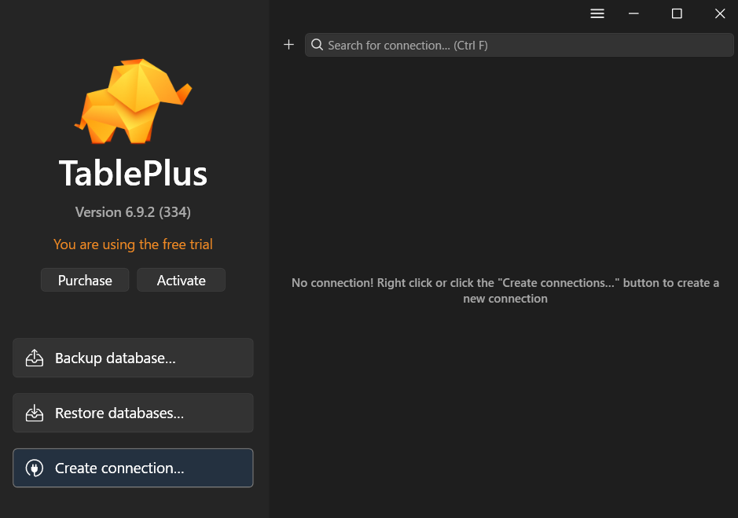

3. `MySQL` を選択し、`Create` を押す。

4. 次のように入力し、`Connect` を押す。

   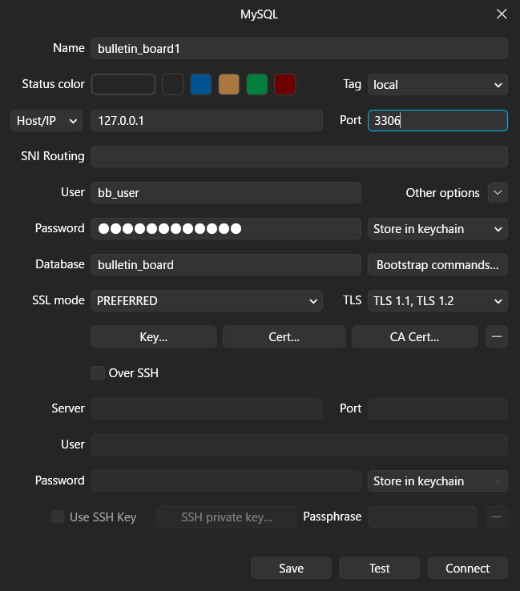
   - 最初の `Name` は何でも良い。
   - `Port`は【3306】にすること。MySQLサーバが標準で使用しているポート番号。
   - `User`, `Password` は、前述の`schema.sql`内で設定したもの。

5. 画面左側の各テーブルをクリックし、画面右クリック > `Add row` を押す。

   まず、usersテーブルにレコードを追加する。

   ::: warning

   postsテーブルより前に、usersテーブルに追加すること。

   postsテーブルの`user_id`カラムは、usersテーブルに依存しているため。

   :::

   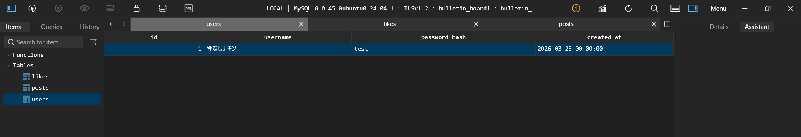

   `Cmd + S` で保存したら、レコード追加完了。

   次に、postsテーブルにも同様にレコードを追加し、`Cmd + S` で保存。

   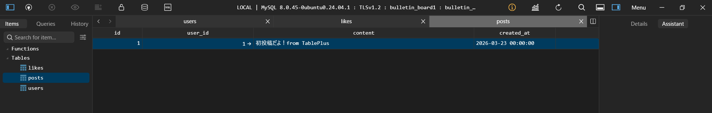

6. 【演習】DBに反映されたか、CLIで確認してみましょう！

   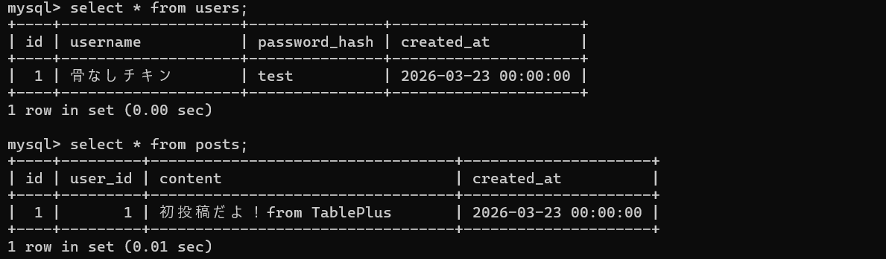

## 4-3. curlコマンド

URLで示されるネットワーク上の場所（エンドポイント）に対して、さまざまなプロトコルでリクエストを送信するためのコマンド。

ex1. 骨なしチキンのxアカウントページにリクエストを投げる

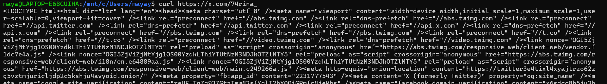

ex2. CLIで天気予報を確認する

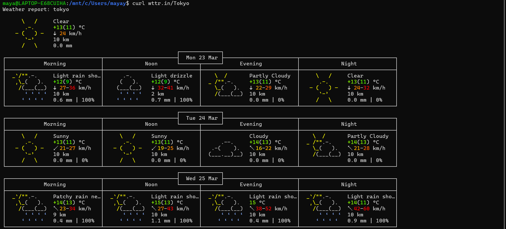

Web開発時も、自分で作成したAPIエンドポイントに対して、curlコマンドでリクエストを送信し、挙動確認・デバッグを行うことが多い。

1. `$ php -S localhost:8000` でWebサーバを起動

2. `/posts`(GET)

   ```
   $ curl -i http://localhost:8000/posts
   ```

   これに対し、`200 OK`および`posts`テーブルの中身が返ってきたら成功。

   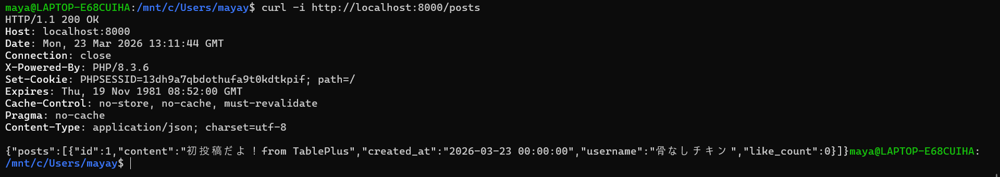

3. `/register`(POST)

   ```
   $ curl -X POST http://localhost:8000/register \

   -H "Content-Type: application/json" \

   -d '{"username":"骨つきチキン","password":"test2"}'
   ```

   これに対し、`registered`が表示されたら成功。

   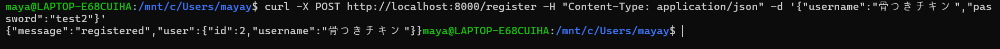

4. 【演習】`users`テーブルに`骨つきチキン/test2`が追加されたか、`4-1`または`4-2`の方法で確認してみましょう！

### curlコマンドのオプションまとめ

- **`-i`**（include）

  レスポンスのヘッダも含める。HTTPのステータスコード（200, 404）を確認できるので、APIのデバッグでは必須。

- **`-v`**（verbose）

  通信の詳細ログを全て表示（リクエストのヘッダも含め）。

- **`-H`**（Header）

  リクエストのヘッダを指定できる。`Content-Type`, `Authorization`など。

- **`-X`**（eXecute?）

  HTTP のメソッドを指定できる。`$ curl -X POST https://example.com/post`など。

- **`-d`**（data）

  POSTリクエストで、データも含める（`-X POST` は不要）。

  `$ curl -d "name=test" https://example.com/register`など。

## 4-4. Postmanでリクエスト送信

前述のcurlコマンドをGUIで実行できる、Postmanというアプリを用いることが多い。

1. https://www.postman.com/downloads/

   から、自分のOSに合わせてアプリをインストールする。

2. `Sign up for Free` でアカウントを新規作成する。

3. 下の画面になれば完了。

   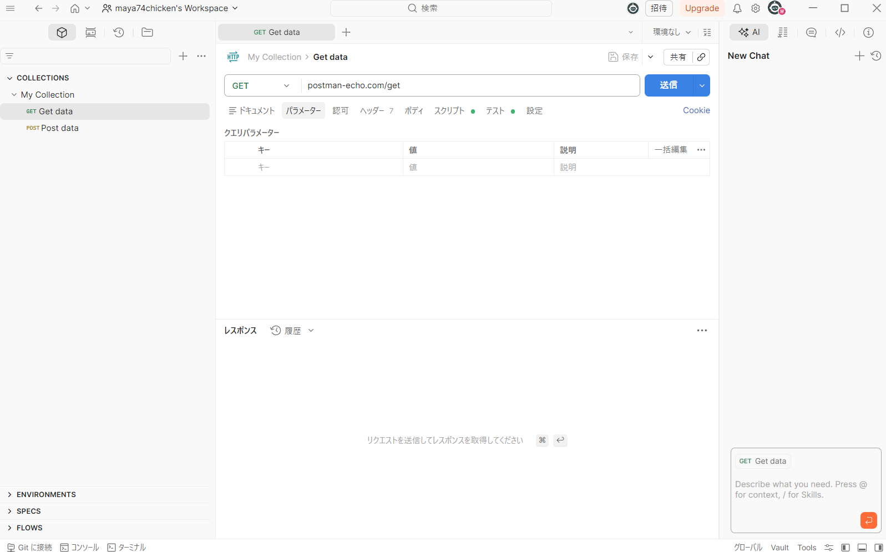

この Postman を用いて、作成したAPIが正常に動いているか、適切なリクエストを投げて挙動確認をしていく。

まず、`$ php -S localhost:8000` でWebサーバを起動しておく。

### `/register`(POST)

- URL：`http://localhost:8000/`

- メソッド：`POST`

- ヘッダ：`Content-Type: application/json`

- ボディ：

  ```json
  {
    "username": "user3",
    "password": "test3"
  }
  ```

`送信`を押すと、次のようなレスポンスが返る。

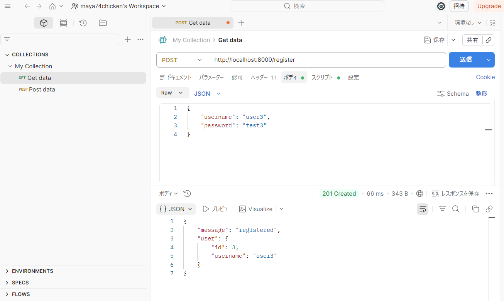

### `/login`(POST)

先ほど登録した `user3 / test3` でログインする。

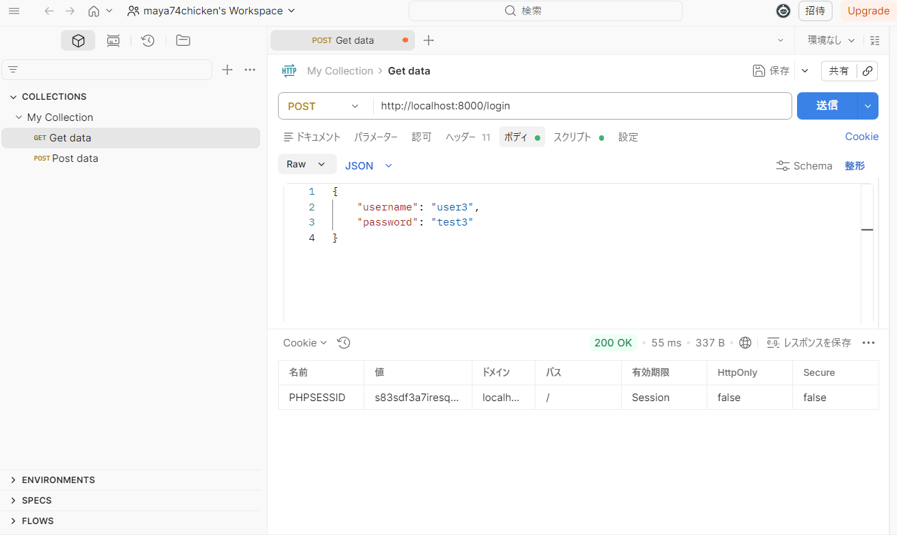

上のように、Cookie が付与されたことを確認する。

以降、掲示板に投稿するには、リクエストにCookieの`PHPSESSID`を含める（＝ログインする）必要がある。ただし、Postmanで連続してリクエストを送る場合は、自動でCookieが付与されるので問題ない。

### `/posts`(POST)

- メソッド：`POST`

- ヘッダ：`Content-Type: application/json`

- ボディ：

  ```json
  {
    "content": "Postmanから投稿してるよ！"
  }
  ```

次のようなレスポンスが返る。

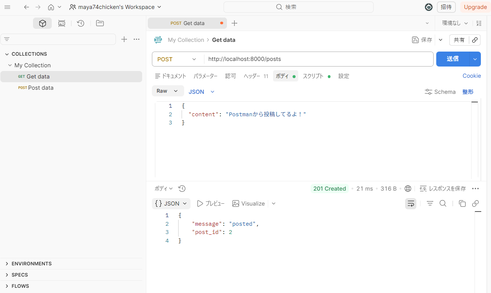

### 【演習】　`/posts`(GET)のAPIが正しく動くか確認しましょう！

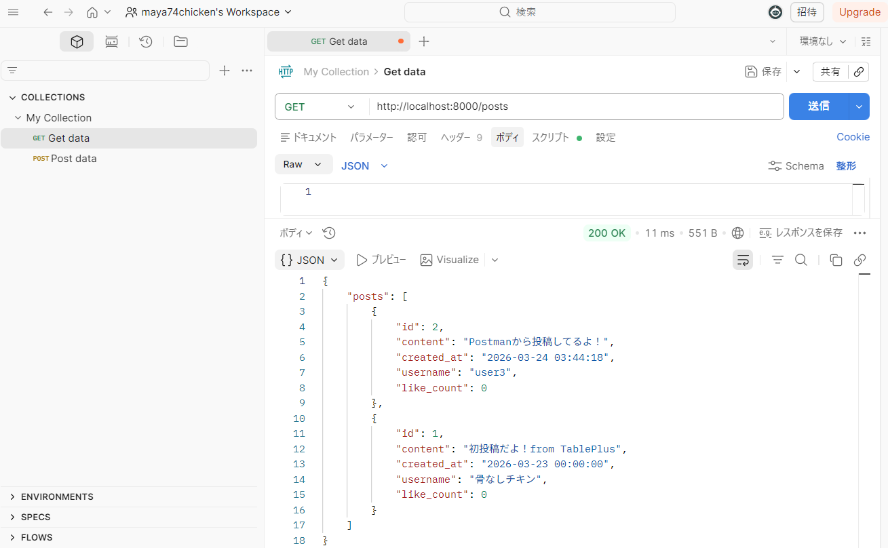

### 【演習】 `posts`テーブルの中身を直接見てみましょう！

- CLI

  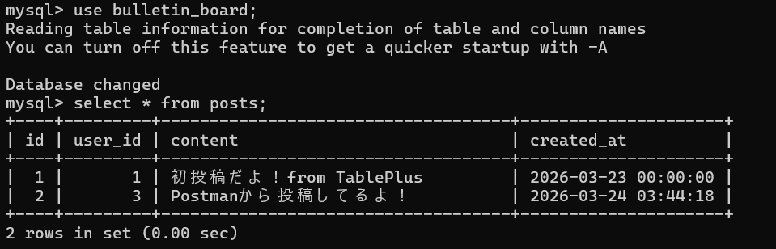

- GUI

  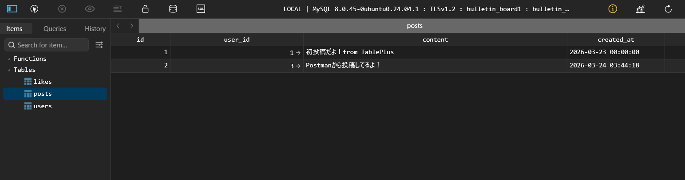

---

## お疲れさまでした！

バックエンドの主役である API と DB について学びました。

完全に理解できなくても、実際に開発する中で、知識が繋がっていく部分が多いです。

次回からはフレームワークを使い、フロントエンドとバックエンドを組み合わせた、フルスタック開発に進みます！

## 参考文献

- Zenn [【API】"RESTの原則"をアンチパターンを基に噛み砕いてみました](https://zenn.dev/kazu_u/articles/dab4e3ec7a19bd)
