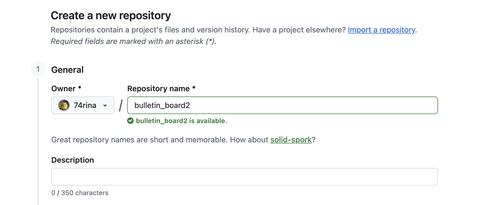
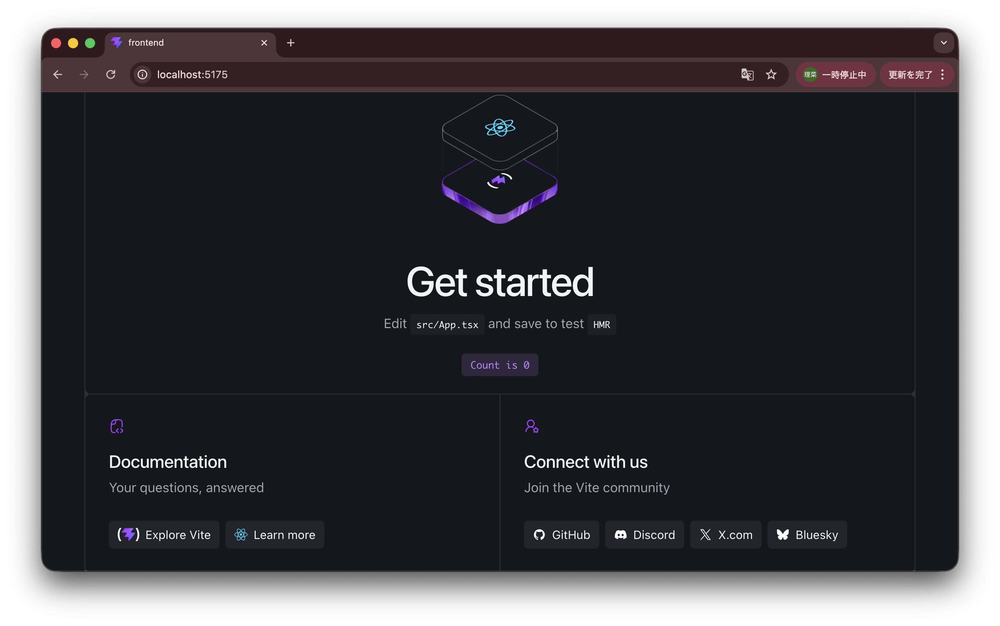
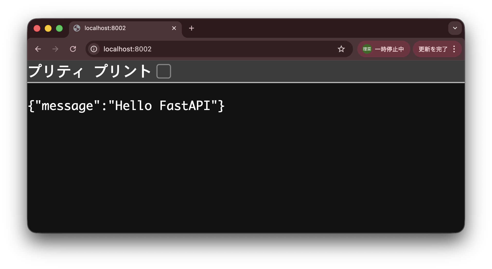
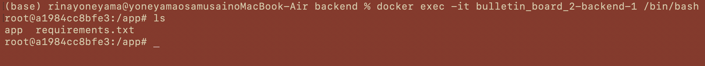
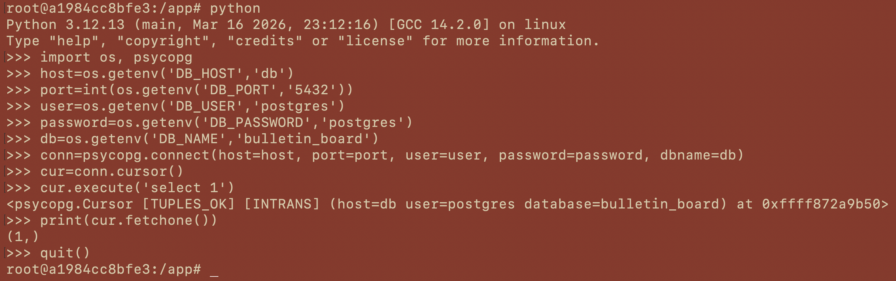
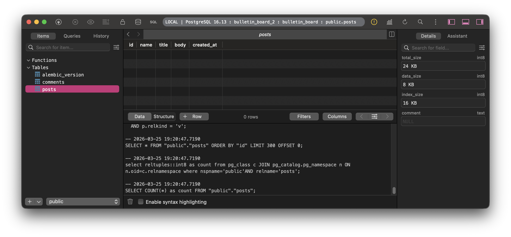

# バックエンド実践 - 掲示板を作る

今までの「フロントエンド入門・実践」「バックエンド入門」で学んだ知識をフル活用させて、フルスタック（フロントエンド︎＋バックエンド）で掲示板の開発に挑戦します！

バックエンドには、色々なPythonライブラリを使用します。KCSの皆さんは、春のPython講習会の内容を思い出してみてください！

---

# 目次

---

1.  **システムの設計**

    1-1. ソフトウェア開発ライフサイクル

    1-2. 要件定義・技術選定

    1-3. MVCモデル

    1-4. プロジェクトの環境構築

2.  **バックエンドの環境構築**

    2-1. CORS設定

    2-2. DBの接続設定

    2-3. Dockerの環境構築

3.  **DBの実装**

    3-1. DBエンティティの定義

    3-2. DBのマイグレーション

4.  **APIの実装**

    4-1. 必要なAPIとスキーマ定義

    4-2. CRUD処理の流れ

    4-3. フロントエンド（JS/TS）でのAPIの叩き方まとめ

5.  **テスト**

---

## 1. システムの設計

## 1-1. ソフトウェア開発ライフサイクル

システムを開発するための一連の流れ。**SDLC**（Software Development Life Cycle）と呼ぶ。

1. **要件定義**
2. **設計**
3. **実装**
4. **テスト**
5. **リリース**
6. **運用・保守**

また、この流れを回す方法として、次の2種類がある。

1. **ウォーターフォール開発**

   「要件 → 設計 → 実装 → テスト → リリース」のフローにおいて、前に戻らない。途中で仕様を変えたくなる場合に弱い。要件が固い、大規模システムの開発で用いる。

2. **アジャイル開発**

   このフローを、短い単位（1〜2週間）で何度も回す。計画がブレやすいが、途中の仕様変更に強い。

実際のWeb開発では、最初にざっくり設計し、以降はアジャイルで回すことが多い。

また、本記事では「設計・実装・テスト」の部分に焦点を当て、掲示板を作っていく。

## 1-2. 要件定義・技術選定

### 要件定義

ユーザーが投稿を作成し、他投稿に対してコメントを行える、匿名掲示板アプリを実装する。

機能要件は次の通り。

- **投稿機能**（ユーザーは、掲示板に投稿を作成できる）
  - 入力項目：名前・タイトル・本文

- **投稿一覧表示機能**（ユーザーは、投稿一覧を閲覧できる）
  - 表示項目：タイトル・本文・投稿日時・コメント数

- **投稿詳細表示機能**（ユーザーは、1件の投稿の詳細を閲覧できる）
  - 表示項目：タイトル・本文・投稿日時・コメント一覧

- **コメント機能**（ユーザーは、投稿に対してコメントできる）

::: tip
**機能要件と非機能要件**

- 機能要件：何ができるか。ユーザーが使う機能そのもの。

- 非機能要件：どういう品質で動くか。性能・安全性・運用性などの条件。

:::

### DBのテーブル設計

フルスタック開発では、DBのテーブル設計を最初に行うと分かりやすい。

今回作る、掲示板のER図は次のようになる。


::: tip
**テーブルとエンティティの違い**

- テーブル：ただの入れ物。users, postsなどの保存構造。

- エンティティ：テーブル＋ロジック（ユースケースに依ったCRUD操作）

  ```python
  class User:
     def change_email(self, new_email):
        ...
  ```

:::

このように、DBのテーブルを最初に設計し、その構造に基づいてアプリケーションを組み立てる方法を **データ駆動開発** と呼ぶ。

::: tip
**ドメイン駆動開発**（DDD：Domain-Driven Design）

「DBテーブル」ではなく「ドメイン（アプリケーションロジック）」を起点に設計する方法。

テーブルを起点に設計するとロジックが分散するので、まず最初にアプリの振る舞いを考え、それを1箇所のエンティティに集約させるイメージ。

:::

### 技術選定

使用するライブラリ（≠フレームワーク）・DBは次の通り。

- フロントエンド：React/Vite（JavaScript, TypeScript）
- バックエンド：FastAPI, SQLAlchemy（Python）
- データベース：PostgreSQL
- Dockerコンテナを3個立てる（frontend, backend, db）

### 選定の理由

- バックエンドでPythonを勉強したかった（？）

- UIはReactでちゃんと作りたいけど、APIの設計にはFastAPIを使うので、フロントエンドにNext.jsほどのフルスタックな機能（APIルート、SSRなど）はいらない。

- 「フロントはUI、バックはAPI」という責務の分離が分かりやすい。

- SQLiteはDBサーバを持たず（＝ dbコンテナも不要）、1ファイルなので楽。しかし、
  1. 今後バックエンドのコンテナを増やして、複数コンテナからDBを操作するとなったときに向かない。

  2. SQLiteでは、宣言した型と異なるデータも格納できてしまう。

  という拡張性・安全性の観点から、より安全で同時アクセスにも強いPostgreSQLを選択。

## 1-3. MVCモデル

Webアプリのプログラムを、次の3つの役割に分けて開発する手法。フルスタック（フロントエンド＋バックエンド）開発で重要。

1. **Model**
   - データ・ビジネスロジック担当。
   - DB接続、データのCRUD操作などを行う。
   - 1つのDBテーブルは、1つのクラス（Python の class）として扱う。
   - DBのリレーションやCRUD操作は、クラスのメソッドとして定義する。

2. **View**
   - HTMLなどの画面表示、UI。

3. **Controller**
   - ModelとViewの橋渡し。Viewで受け取ったユーザ入力を、適切にModelに渡し、その結果をViewに渡す。
   - 各々の処理は、関数としてコンポーネント化し、Viewで呼び出される。

View → Controller → Model → Controller → View のようにデータが渡る。

::: tip
MVCのModelの責務が大きすぎる（＝ Fat Model）ため、最近は、Modelをさらに細分化したアーキテクチャも主流。

View → Controller → Service → Domain → Repository

- Service：Controllerで呼ばれる処理。ユースケースごとに様々。
- Domain：Serviceから受け取ったデータの加工ロジック。
- Repository：DBのCRUD操作

:::

MVCモデルでWebアプリの一連の処理を考えると、次のようになる。

1. **リクエスト**：ユーザーがブラウザで操作（URLなどの入力・クリック）を行う。
2. **受け取り**：Controllerがリクエストを受け取る。
3. **処理依頼**：ControllerがModelにデータの処理を依頼する。
4. **データ操作**：Modelがデータベース（DB）からデータを取得・更新する。
5. **結果返却**：Modelが処理結果をControllerに返す。
6. **画面更新指示**：ControllerがViewにデータを渡して画面の生成を指示する。
7. **レスポンス**：ViewがHTML画面を生成し、ブラウザへ返す。

今回の React + FastAPI 構成では、

- View：React
- Controller：FastAPI（router / endpoint）
- Model：SQLAlchemy（ORM）

のように責務を分離できる。

## 1-4. プロジェクトの環境構築

### ディレクトリの作成

プロジェクトのディレクトリ構成は、次のようになる。

```
bulletin_board_2/
├── frontend/
├── backend/
├── db/
│
├── docker-compose.yml
├── .env
├── .gitignore
└── README.md
```

まず、プロジェクトのディレクトリを新規作成し、そこに移動しておく。

```
$ mkdir bulletin_board_2

$ cd bulletin_board_2
```

### Git/GitHubの設定

プロジェクトのルートで、以下を実行し、Gitを初期化する。

```
$ git init
```

また、GitHub上でリポジトリを新規作成する。



その後、ローカルで

```
$ git remote add origin https://github.com/74rina/bulletin_board_2.git

$ git add .

$ git commit -m "initial_commit"

$ git push origin main
```

を実行し、ローカルとリモートリポジトリを紐づける。

### フロントエンド（React/Vite）

1.  Vite製プロジェクトの作成（frontendディレクトリを作る）

    ```
    $ npm create vite@latest frontend
    ```

    - Select a framework: `React`
    - Select a variant: `TypeScript`
    - Install with npm and start now?: `Yes`

    を選択。

2.  frontendディレクトリに移動

    ```
    $ cd frontend
    ```

3.  依存関係のインストール・開発用サーバの起動

    ```
    $ npm install

    $ npm run dev
    ```

4.  ブラウザで以下の画面が表示されたら成功。

    

### バックエンド（Pythonライブラリ）

必要であれば、ローカルでPythonを使えるようにしてください。

> 1. ターミナルで、
>
> （WSL）`$ sudo apt install python3`
>
> （Mac）`$ brew install python3`
>
> 2. 拡張機能 > `Python` をインストール

1. プロジェクトのルートで、backendディレクトリを作る

   ```
   $ cd ..

   $ mkdir backend

   $ cd backend
   ```

2. **Python の仮想環境の作成**

   ::: tip
   **Pythonの仮想環境（venv）**

   プロジェクトごとに、独立したPython実行環境を作成する仕組み。

   仮想環境を作成する（`python -m venv venv`）ことで、各プロジェクト内に`venv`ディレクトリが作られ、その中に、専用のPython実行環境＋ライブラリのインストール先が用意される。

   その後、仮想環境を有効化する（`source venv/bin/activate`）ことで、その環境内のPythonやライブラリが使用されるようになる。

   Python仮想環境の構築手順は毎回同じなので、覚えてしまいましょう！
   :::

   backend/ で以下を実行し、仮想環境を作成する。

   ```
   $ python3 -m venv venv

   $ source venv/bin/activate
   ```

3. 使用するライブラリのインストール
   - FastAPI（API設計、HTTP処理）
   - Alembic（DBのマイグレーション ← 後述）
   - Uvicorn（PythonのWebサーバ）

   ```
   $ pip install fastapi alembic uvicorn[standard]
   ```

4. アプリケーション用ディレクトリとファイルの作成

   ```
   $ mkdir app

   $ touch app/main.py

   $ touch requirements.txt
   ```

5. ` app/main.py` に FastAPI の最小構成コードを書く

   ```python
   from fastapi import FastAPI

   app = FastAPI()

   @app.get("/")
   def read_root():
       return {"message": "Hello FastAPI"}
   ```

6. インストールした依存関係を `requirements.txt` に保存

   ```
   $ pip freeze > requirements.txt
   ```

   ::: tip
   **requirements.txt**

   このプロジェクトで使うPythonライブラリ一覧（の名前＋バージョン情報）。

   これを他者がクローンし、

   ```
   pip install -r requirements.txt
   ```

   を実行することで、同じPython環境を再現できる。

   npmとの比較は以下。

   | JavaScript        | Python                  |
   | ----------------- | ----------------------- |
   | package.json      | requirements.txt        |
   | npm install       | pip install             |
   | node_modules      | venv                    |
   | package-lock.json | （ほぼ無い / 別ツール） |

   :::

7. 開発用サーバの起動

   ```
   $ uvicorn app.main:app --reload --port 8000
   ```

8. ブラウザで `http://localhost:8000` にアクセスし、以下の画面が表示されたら成功。

   

---

## 2. バックエンドの環境構築

## 2-1. CORS設定

**CORS**（Cross-Origin Resource Sharing）とは、**同一オリジンポリシー**（JSは、同じオリジンのデータしか読めない）をホワイトリストで緩和したもの。

::: tip

- **ホワイトリスト**：許可したものだけ通す（CORS, 認証など）

- **ブラックリスト**：禁止したものだけ弾く（ユーザ入力など）

:::

今回は、フロントエンドとバックエンドを別ポート（＝ 別オリジン）で動かすので、CORS設定が必要である。

HTTPリクエストに次のようなヘッダを含めることで、異なるオリジン間で、安全なデータ通信ができる。

```
Access-Control-Allow-Origin: 許可するオリジン（"http://localhost:5173" など）
Access-Control-Allow-Methods: 許可するHTTPメソッド（GET, POST, PUTなど）
```

::: warning
`Access-Control-Allow-Origin: * `

の場合は、全オリジンを許可しているので、第三者からの不正アクセスに注意。
:::

今回は、`backend/app/main.py`内に、次のようなCORS設定を追加する。

```python
from fastapi import FastAPI
from fastapi.middleware.cors import CORSMiddleware

app = FastAPI()

app.add_middleware(
    CORSMiddleware,
    allow_origins=["http://localhost:5173"],
    allow_credentials=True,
    allow_methods=["*"],
    allow_headers=["*"],
)

@app.get("/")
def read_root():
    return {"message": "Hello FastAPI"}
```

## 2-2. DBの接続設定

### SQLAlchemy でDBに接続

SQLAlchemyのORMを使うことで、DB内のデータをPythonオブジェクトとして扱え、DB操作が容易になる。

::: tip

**ORM**（Object-Relational Mapping）

バックエンドから、オブジェクト指向でDBを操作するためのもの。SQLAlchemy（Python系）、Eloquent ORM（PHP系）などのライブラリ。

::: info
**じゃあフレームワークは？**

→ これらのライブラリの詰め合わせ。
:::

| DB（SQL）      | ORM（Pythonの場合） |
| -------------- | ------------------- |
| テーブル       | クラス              |
| レコード（行） | インスタンス        |
| カラム（列）   | 属性（フィールド）  |
| CRUD操作       | クラスのメソッド    |

:::

まず、このライブラリをインストールする。

```
$ source venv/bin/activate（必要であれば仮想環境を有効化）

$ pip install sqlalchemy psycopg fastapi uvicorn
```

### DBサーバの接続設定

`/app/database.py` を次のように作成し、DBの接続を設定する。

```python
import os
from dotenv import load_dotenv
from sqlalchemy import create_engine
from sqlalchemy.orm import DeclarativeBase, sessionmaker

class Base(DeclarativeBase):
    pass

load_dotenv()

DATABASE_URL = os.getenv("DATABASE_URL")
if not DATABASE_URL:
    db_host = os.getenv("DB_HOST", "localhost")
    db_port = os.getenv("DB_PORT", "5432")
    db_user = os.getenv("DB_USER", "postgres")
    db_password = os.getenv("DB_PASSWORD", "postgres")
    db_name = os.getenv("DB_NAME", "bulletin_board")
    DATABASE_URL = (
        f"postgresql+psycopg://{db_user}:{db_password}@{db_host}:{db_port}/{db_name}"
    )

engine = create_engine(
    DATABASE_URL,
    future=True,
)

SessionLocal = sessionmaker(
    bind=engine,
    autocommit=False,
    autoflush=False,
)
```

`DATABASE_URL`（DBサーバの種類・ポートなどの情報）は、ハードコーディングせず、環境変数で管理する。

次のように `env.example` を作成する。

```conf
DB_HOST=localhost
DB_PORT=5432
DB_USER=postgres
DB_PASSWORD=postgres
DB_NAME=bulletin_board
```

`.env.example`にはダミー情報を書き、GitHubで公開しておく。真の値（`.env`の中身）はリモートで公開せず、別の安全な方法で共有する。

::: warning
`.gitignore` に `.env` を追加することを忘れずに！
:::

チーム開発の環境構築では、まず手元で`.env`を作成する必要がある。

## 2-3. Dockerの環境構築

### コンテナの構成

1. frontend（イメージは`frontend/Dockerfile`）
2. backend（イメージは`backend/Dockerfile`）
3. db（イメージは既存の`postgres`）

これらの3コンテナを、`compose.yaml` で一気に起動して、運用する。

### イメージ（Dockerfile）の作成

- `frontend/Dockerfile`

  ```dockerfile
  FROM node:20-alpine
  WORKDIR /app
  COPY package.json package-lock.json ./
  RUN npm ci
  COPY . .
  CMD ["npm", "run", "dev", "--", "--host", "0.0.0.0", "--port", "5173"]
  ```

- `backend/Dockerfile`

  ```dockerfile
  FROM python:3.12-slim
  WORKDIR /app
  ENV PYTHONDONTWRITEBYTECODE=1
  ENV PYTHONUNBUFFERED=1
  COPY requirements.txt .
  RUN pip install --no-cache-dir -r requirements.txt
  COPY app ./app
  CMD ["uvicorn", "app.main:app", "--host", "0.0.0.0", "--port", "8000", "--reload"]
  ```

### 3コンテナの管理（compose.yaml）

```yaml
services:
  db:
    image: postgres:16
    environment:
      POSTGRES_USER: ${DB_USER:-postgres}
      POSTGRES_PASSWORD: ${DB_PASSWORD:-postgres}
      POSTGRES_DB: ${DB_NAME:-bulletin_board}
    ports:
      - "5432:5432"
    volumes:
      - db_data:/var/lib/postgresql/data

  backend:
    build: ./backend
    environment:
      DB_HOST: db
      DB_PORT: 5432
      DB_USER: ${DB_USER:-postgres}
      DB_PASSWORD: ${DB_PASSWORD:-postgres}
      DB_NAME: ${DB_NAME:-bulletin_board}
    ports:
      - "8000:8000"
    depends_on:
      - db

  frontend:
    build: ./frontend
    environment:
      VITE_API_BASE_URL: http://localhost:8000
    ports:
      - "5173:5173"
    depends_on:
      - backend

volumes:
  db_data:
```

- `environment:`で指定することで`.env`が自動で読み込まれ、`${環境変数名}`で参照できる。

### 挙動確認（テスト）

1. **アプリケーションのビルド**

   ```
   $ docker compose up --build
   ```

   の実行後、ブラウザで `http://localhost:8000`（∵ `ports:"8000:8000"`の左側）にアクセスし、`{"message":"Hello FastAPI"}`が表示されることを確認する。

   ::: info
   エラーになる場合は、**①ポート競合** ②Dockerイメージビルドのキャッシュなど を考えてみる！
   :::

2. **バックエンドとDBの接続確認**（任意）

   ```
   $ docker exec -it bulletin_board_2-backend-1 /bin/bash
   ```

   で、backendコンテナの中に入る（`サービス名＋コンテナ名`を入力）。次のようなシェルになれば良い。

   

   このbackendコンテナから、DBに接続できるか確認する。

   コンテナ内で `$ python` を実行することで、Python実行環境に入ることができるので、以下のように接続確認を行った（`>>>`の行が入力部分）。

   

---

## 3. DBの実装

## 3-1. DBエンティティの定義

`/app/models.py` を次のように作成する。

中には、`1-2. 要件定義・技術選定` > `DBのテーブル設計` で設計したDBテーブル・ロジックが、Pythonのクラス・メソッドとして書かれている。

```python
from datetime import datetime

from sqlalchemy import DateTime, ForeignKey, Integer, String, Text, func
from sqlalchemy.orm import Mapped, mapped_column, relationship

from .database import Base


class Post(Base):
    __tablename__ = "posts"

    id: Mapped[int] = mapped_column(Integer, primary_key=True, index=True)
    name: Mapped[str] = mapped_column(String(50), nullable=False)
    title: Mapped[str] = mapped_column(String(200), nullable=False)
    body: Mapped[str] = mapped_column(Text, nullable=False)
    created_at: Mapped[datetime] = mapped_column(
        DateTime(timezone=True),
        server_default=func.now(),
        nullable=False,
    )

    comments: Mapped[list["Comment"]] = relationship(
        back_populates="post",
        cascade="all, delete-orphan",
    )


class Comment(Base):
    __tablename__ = "comments"

    id: Mapped[int] = mapped_column(Integer, primary_key=True, index=True)
    post_id: Mapped[int] = mapped_column(
        Integer,
        ForeignKey("posts.id", ondelete="CASCADE"),
        nullable=False,
        index=True,
    )
    body: Mapped[str] = mapped_column(Text, nullable=False)
    created_at: Mapped[datetime] = mapped_column(
        DateTime(timezone=True),
        server_default=func.now(),
        nullable=False,
    )

    post: Mapped[Post] = relationship(back_populates="comments")
```

## 3-2. DBのマイグレーション

Web開発において、DBの変更履歴を「コードで管理する」仕組み。

次のような**マイグレーションファイル**を用意する（ライブラリがやってくれる）。

```
001_create_posts_table.sql
002_add_title_column.sql
003_create_comments_table.sql
```

中にはDBを変更するSQLクエリが書かれており、時系列でDBの変更履歴がわかる。

チーム開発において、空のDBがある状態で、上記のマイグレーションを実行すれば、

```
空のDB → postsテーブル追加 → titleカラム追加 → commentsテーブル追加
```

が実行され（ファイルに書かれたSQLクエリが走り）、テーブルを作成できる。

例えばPythonでは、Alembicというライブラリが、`/app/models.py`（ファイル名は仕様）に定義された SQLAlchemyのエンティティと現在のDB状態との差分をもとに、マイグレーションファイルを作成する。

1. Alembicの初期化

   backend/ で次を実行する。

   ```
   $ alembic init alembic
   ```

   → `alembic`ディレクトリ・`alembic.ini`ファイルが作られる。

2. `alembic/env.py` の作成

   ```python
   from logging.config import fileConfig
   from pathlib import Path
   import sys
   from sqlalchemy import engine_from_config
   from sqlalchemy import pool
   from alembic import context

   config = context.config

   if config.config_file_name is not None:
      fileConfig(config.config_file_name)

   PROJECT_ROOT = Path(__file__).resolve().parents[1]
   sys.path.append(str(PROJECT_ROOT))

   from app.database import DATABASE_URL  # noqa: E402
   from app.database import Base  # noqa: E402
   from app import models  # noqa: F401, E402

   config.set_main_option("sqlalchemy.url", DATABASE_URL)

   target_metadata = Base.metadata

   def run_migrations_offline() -> None:
      url = config.get_main_option("sqlalchemy.url")
      context.configure(
         url=url,
         target_metadata=target_metadata,
         literal_binds=True,
         dialect_opts={"paramstyle": "named"},
      )
      with context.begin_transaction():
         context.run_migrations()

   def run_migrations_online() -> None:
      connectable = engine_from_config(
         config.get_section(config.config_ini_section, {}),
         prefix="sqlalchemy.",
         poolclass=pool.NullPool,
      )
      with connectable.connect() as connection:
         context.configure(
               connection=connection, target_metadata=target_metadata
         )
         with context.begin_transaction():
               context.run_migrations()
   if context.is_offline_mode():
      run_migrations_offline()
   else:
      run_migrations_online()

   ```

3. Dockerコンテナの再ビルド

   ```
   $ cd ..

   $ docker compose build backend

   $ docker compose up -d
   ```

4. **Dockerコンテナの中に入って**マイグレーション実行

   ```
   $ cd backend

   $ docker compose exec backend alembic revision --autogenerate -m "create posts and comments"

   $ docker compose exec backend alembic upgrade head
   ```

5. DBのテーブルが作成されたか確認

   TablePlusのGUIでDBのポートに接続し、次のようにテーブル（中身は空）が作られていたら成功。

   

::: tip

チーム開発で、他者がこの環境を再現するときは、

`$ docker compose exec backend alembic upgrade head`

で既存のマイグレーションファイル通りにSQLクエリを実行するだけで良い。

:::

## 4. APIの実装

## 4-1. 必要なAPIとスキーマ定義

`1-2. 要件定義・技術選定` で定義した機能要件に基づいて、必要なAPIをまとめると、次のようになる。

- GET `/posts`（投稿一覧の閲覧）
- GET `/posts/${postId}`（投稿詳細の閲覧）
- POST `/posts`（投稿する）
- POST `/comments`（コメントする）

ここで、**DBスキーマ**を作成する。

DBのスキーマ（狭義）とは、APIで値をやり取りする際の**型定義**のこと。「このAPIはこの型のデータを扱う」という定義。

`backend/app/schemas.py` に、各APIのスキーマを次のように書く。

```python
from datetime import datetime
from typing import List
from pydantic import BaseModel

class PostCreate(BaseModel):
    name: str
    title: str
    body: str

class CommentCreate(BaseModel):
    body: str

class CommentOut(BaseModel):
    id: int
    body: str
    created_at: datetime

    class Config:
        from_attributes = True

class PostListItem(BaseModel):
    id: int
    name: str
    title: str
    body: str
    created_at: datetime
    comment_count: int

    class Config:
        from_attributes = True

class PostDetail(BaseModel):
    id: int
    name: str
    title: str
    body: str
    created_at: datetime
    comments: List[CommentOut]

    class Config:
        from_attributes = True
```

## 4-2. CRUD処理の流れ

「ユーザーがAPIエンドポイント（URL）にアクセスし、DBに対してCRUD操作が走る」一連の流れは以下。

1. `frontend/src/App.tsx` で、ボタン押下をきっかけに `fetch()` を実行する（→JSオブジェクトができる）
2. そのJSオブジェクトをJSON文字列にして、APIエンドポイントに送る
3. `backend/main.py` で、受け取ったJSONをパースして、SQLAlchemy でDBに問い合わせる
4. DB操作の結果をオブジェクトとして受け取り、FastAPIがそれをJSON文字列にする
5. `frontend/src/App.tsx` で、`await res.json()` で受け取る

実際のコードで見ていく。

### 掲示板に投稿する例

1. `frontend/src/App.tsx` のHTMLで、投稿フォームを用意する。

   ```html
   <div className="hero-panel">
          <form className="card" onSubmit={handleCreatePost}>
            <h2>新規投稿</h2>
            <label>
              名前
              <input
                value={name}
                onChange={(event) => setName(event.target.value)}
                placeholder="例: 匿名さん"
                required
              />
            </label>
            <label>
              タイトル
              <input
                value={title}
                onChange={(event) => setTitle(event.target.value)}
                placeholder="気になっていること"
                required
              />
            </label>
            <label>
              本文
              <textarea
                value={body}
                onChange={(event) => setBody(event.target.value)}
                placeholder="内容を自由に書いてください"
                required
              />
            </label>
            <button type="submit">投稿する</button>
          </form>
        </div>
   ```

   `<button type="submit">`なので、このボタンが押されたときに、中身の要素がサーバーに送られる。

2. onSubmit時に発火する`handleCreatePost()`を実装する。

   ```tsx
   const handleCreatePost = async (event: React.FormEvent) => {
     event.preventDefault();
     setError(null);
     try {
       const res = await fetch(`${API_BASE}/posts`, {
         method: "POST",
         headers: { "Content-Type": "application/json" },
         body: JSON.stringify({ name, title, body }),
       });
       if (!res.ok) throw new Error("投稿の作成に失敗しました。");
       setName("");
       setTitle("");
       setBody("");
       await fetchPosts();
     } catch (err) {
       setError(err instanceof Error ? err.message : "エラーが発生しました。");
     }
   };
   ```

   - 適切なメソッド・ヘッダを持った、`res`というオブジェクトが作られる。この関数オブジェクトの戻り値が**HTTPレスポンス**になる。

   - `body: JSON.stringify({ name, title, body }),` により、フォームの入力値を使って、JSON形式のHTTPリクエストを構築している。

   - `fetch()` が発火した瞬間、ブラウザが自動的にHTTPリクエストをサーバに送る。

3. `backend/main.py` で、受け取った値でDB操作のSQLクエリを作るための関数を定義する。

   ```python
   from . import models

   @app.post("/posts", response_model=schemas.PostListItem)
   def create_post(payload: schemas.PostCreate, db: Session = Depends(get_db)):
      post = models.Post(name=payload.name, title=payload.title, body=payload.body)
      db.add(post)
      db.commit()
      db.refresh(post)
      return schemas.PostListItem(
         id=post.id,
         name=post.name,
         title=post.title,
         body=post.body,
         created_at=post.created_at,
         comment_count=0,
      )
   ```

   - `post = models.Post(name=...)` で、DBを操作するための関数オブジェクト（Post型）を作る。戻り値はSQLクエリ。

   - そのオブジェクトを`db.add()`や`db.commit()`の引数に入れて、SQLクエリがDBに発行される。

     ::: tip
     `db`は`sqlalchemy.orm.Session`型で、add(), commit(), query() などのメソッドを持つ。この型は、SQLAlchemyライブラリが提供してくれる。s
     :::

   - `backend/app/schemas.py`で定義したAPIのスキーマ（型）に即して、DB操作の結果を戻り値とする。

   - この後、FastAPIが自動でJSONに変換し、HTTPレスポンスが返る（＝ `res`オブジェクトの戻り値）。

4. 今投稿した投稿も含め、画面が更新されるよう、`frontend/src/App.tsx` で次を実行する。

   ```tsx
   await fetchPosts();
   ```

   `fetchPosts()`の中身は以下。

   ```tsx
   const fetchPosts = async () => {
     setLoadingPosts(true);
     setError(null);
     try {
       const res = await fetch(`${API_BASE}/posts`);
       if (!res.ok) throw new Error("投稿一覧の取得に失敗しました。");
       const data = (await res.json()) as PostListItem[];
       setPosts(data);
       if (data.length && !selectedPostId) {
         setSelectedPostId(data[0].id);
       }
     } catch (err) {
       setError(err instanceof Error ? err.message : "エラーが発生しました。");
     } finally {
       setLoadingPosts(false);
     }
   };
   ```

詳しい実装は、[GitHubリポジトリ](https://github.com/74rina/bulletin_board_2) を参照。

【演習】ブラウザから投稿してみて、DBに値が格納されているかも確認してみましょう！

## 4-3. フロントエンド（JS/TS）でのAPIの叩き方まとめ

`4-2`をまとめると、フロントエンドでは、フォームの入力値を使ってHTTPリクエストを作り、それをサーバに投げる処理を行っていた。

### 非同期処理

JavaScript, Pythonなど、一般的なプログラミング言語は、上から順番にプログラムが実行されていく（同期的）。

しかし、途中でネットワーク越しの処理（APIを叩くなど）が入った場合、そのレスポンスが返ってくるまで次の行に進めないので、アプリが固まってしまう。

そこで「ユーザー体験を止めない」という目的で、

- あるタスクの実行中に、その処理を止めることなく別のタスクを実行する

という**非同期処理**が開発された。

### Promise型

JS/TSにおいて、非同期処理の結果（＝ 非同期処理を行う関数の戻り値）はPromise型である。

```js
function asyncTask(): Promise<string> {
  return new Promise((resolve, reject) => {
    setTimeout(() => {
      resolve("完了")
    }, 1000)
  })
}
```

::: warning

JavaScriptにおいて「Promise型」とは、**Promiseクラスのインスタンス**であるということ。TypeScript（型付き）ではPromise型として扱える。

:::

### async と await

前述の Promise 型を実際に明記することは少ない。代わりに、次の修飾子（演算子）をつけることで非同期処理を書ける。

1. **async**

   これがついた関数の戻り値はPromise型。

   ```js
   async function foo() {
     return 42; // int型 ではなく Promise 型！
   }
   ```

2. **await**

   非同期関数の戻り値（Promise型）を、`int`や`str`などの値として受け取りたいとき、

   ```js
   const result = await foo(); // 42
   ```

   のように、Promise型オブジェクトの前に await をつけることで解決。

---

## お疲れさまでした！！！！！

今回制作した掲示板に対しては、

- いいね機能をつける

- 会員制にする（ログイン機能）

- 投稿を編集・削除できるようにする

- 本番デプロイに対応する

などの拡張が考えられます。ぜひ各自で深めてみてください！

## おわりに

【入門】Web開発のすすめ1 を最後までお読みいただき、ありがとうございました！

Web開発におけるフロントエンド・バックエンドの基礎知識や、チーム開発の基本ルールを一通り学ぶことができました。

【発展】Web開発のすすめ2 では、フロントエンド・バックエンド・インフラそれぞれについて、より実践的かつ応用的な技術をまとめていく予定です。

引き続き、一緒に学んでいきましょう！(ﾟ∀ﾟ≡ﾟ∀ﾟ)

## 参考文献

- MDN「Math.random()」

https://developer.mozilla.org/ja/docs/Web/JavaScript/Reference/Global_Objects/Math/random
