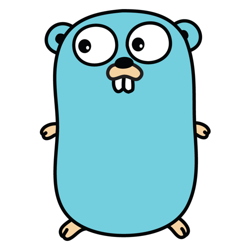
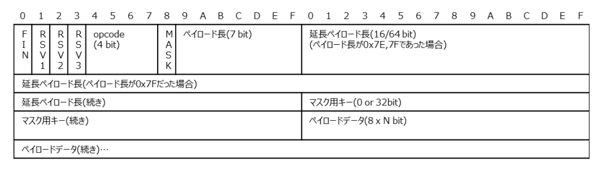

# 「CSS絵しりとり」の裏側

骨なしチキン

---

# 「CSS絵しりとり」とは...



CSS版の伝言ゲーム。
HTMLが渡されるので、前の人が作った絵の通りに、CSSを書く。

フロントエンド：Next.js
バックエンド：Go
データベース：PostgreSQL

---

# 目次

1. リアルタイム通信の実現方法

2. WebSocket

3. c10k問題

4. OSのネットワーク処理

5. Goroutine

---

# 1. リアルタイム通信の実現方法

1.  **ポーリング**
    クライアントが定期的にHTTPリクエストを投げる。

    ```
    Client「新しいデータある？」
    Server「まだない」
    Client「新しいデータある？」
    Server「来た」
    ```

    無駄な通信が発生するので...↓

2.  **ロングポーリング**
    ```
    クライアント「新しいデータある？」
    サーバ　（データが来るまで待つ）
    サーバ　（来たので返す）
    ```

---

3. **WebSocket**
   クライアントとWebサーバ間で双方向通信を行うための通信プロトコル。

   使用例
   - **Discord**
     REST API：Python / Rust
     WebSocket：Phoenixフレームワーク（← Elixir で書く）
   - **Slack**
     API：Hack（PHPを改造した言語）
     WebSocket：Java / Goなど
   - **ゲーム系**
     Node.js 上で Socket.IOライブラリ

---

# 2. WebSocket

## ハンドシェイク

最初の一回だけ、以下のヘッダをつけてHTTPリクエストを投げる。

```
GET /chat HTTP/1.1
Upgrade: websocket
```

これに対し、

```
101 Switching Protcols
```

のレスポンスが返ってくるので、ここでHTTPが終了し、以降はWebSocketフレームでの通信となる（`101`：プロトコル切り替えのステータスコード）。

---

## WebSocketフレーム



- `opcode`: フレームのデータの種類。text, binary, ping/pong（接続確認）など。
- `payload`：マスク用キーでXORされたデータ

---

## WebSocketサーバ（ライブラリ）の機能

connection, rooms, broadcast の3機能を持つ。多くのWebSocket のライブラリがこれらで構成されている。

1. **connection**（接続）
   サーバが接続中のソケット（1ソケット＝1TCP接続）を管理するクラス/構造体。

   ```
   connections = {
   socket1,
   socket2,
   socket3
   }
   ```

   のように管理される。

---

2. **rooms**（部屋）
   connections を以下のようにグループ化した配列。チャットルームやゲームの対戦相手など、接続の範囲を制御するためのもの。

   ```
   rooms = {
   "roomA": [conn1, conn2],
   "roomB": [conn3, conn4, conn5]
   }
   ```

   3つの操作（メソッド）を持つ。
   1. **join**（`roomA.add(conn1)`, `rooms["roomA"].append(conn1)`）
   2. **leave**（`roomA.remove(conn1)`, `rooms["roomA"].remove(conn1)`）
   3. **disconnect**（conn1をroomから削除）

---

3. **broadcast**
   接続中のソケットに同じメッセージを送るプログラム。
   - 接続中の全てのソケットにブロードキャストする
     ```
     for conn in connections:
             conn.send(msg)
     ```
   - 特定のroom内のソケットにブロードキャストする
     ```
     for conn in rooms["roomA"]:
             conn.send(msg)
     ```

---

## WebSocket用のライブラリ

1. **Socket.IO**（JavaScript）
   Node.js サーバ上で動く（Node.js＝JavaScriptランタイム＋HTTPサーバ）。
   WebSocket, HTTPロングポーリング自動切り替えに対応。

2. Gorilla WebSocket（Go）
   Goの並行処理（goroutine）を用いる。

3. tokio-tungstenite（Rust）
   Rustの非同期ランタイム Tokio 用。

---

# 3. c10k問題（Client 10,000 Problem）

1999年に Dan Kegel 氏が提唱した、「10,000台のクライアントからの接続を、Webサーバはどのように処理するか？」という問題。

それまでのWebサーバのOSは、**1リクエスト＝1スレッド**で接続を処理していたので、10000接続＝10000スレッドにもなれば、メモリが死亡する（仕組みは後述）。

---

# 4. OSのネットワーク処理

OSは、複数の実行単位（**プロセス**や**スレッド**）を**コンテキストスイッチ**しながら、それぞれにCPU時間を割り当てることで、マルチタスク（並列処理）を実現している。

プロセスの例

```
Process 1 : Chrome起動
Process 2 : VSCode起動
```

スレッドの例

```
Chromeを起動するプロセス
 ├ UIスレッド
 ├ JavaScript実行スレッド
 ├ ネットワークスレッド
```

---

つまり、

- **プロセス**
  実行中のプログラムの箱。プロセス同士は、基本的にメモリを共有しない。

- **スレッド**
  プロセスの中の実行単位。スレッド同士は、同じメモリを共有する。

※「メモリを共有しない」の意味
別のプロセスには、**別の仮想アドレス空間**を割り当てること（1つのプロセスに紐づく複数のスレッドは全て、同じ仮想アドレス空間に存在する）。
CPUのMMU（メモリ管理ユニット）が、ページテーブルを用いて、仮想アドレスを物理アドレスに変換する。

---

## イベント駆動型の仕組み

Apacheのようなスレッド型では、大量接続に耐えられないので、Nginxのような**イベント駆動型**が開発された。**1スレッドで接続を維持する**もの。

1. サーバを起動すると、1つのスレッド（メインスレッド）が開始する。
2. OSの非同期I/O機能（後述）に接続が登録される
3. イベントループが開始する（`while (1) { ... }`）

CPUの負荷が削減される理由

- コンテキストスイッチ（スレッドの切り替え）がない
- OSの通知が来るまでスリープ状態

---

## 非同期I/O

CPUが、I/O完了を待たずに他の処理をできる仕組み。

| OS      | 名前 / API                    | 設計思想・特徴                                                                              |
| ------- | ----------------------------- | ------------------------------------------------------------------------------------------- |
| Linux   | `epoll`                       | 大量のソケットを効率的に監視するために作られた。**イベント駆動 + Edge/Levelトリガ**が可能。 |
| macOS   | `kqueue`                      | 同じくイベント駆動型。ソケットだけでなくファイル、タイマーなども監視可能。                  |
| Windows | `IOCP` (I/O Completion Ports) | 完全非同期型。スレッドプールと連動して効率的に多数接続を捌く。                              |

---

# 5. Goroutine

Go ランタイム上の軽量スレッド。

- 普通は、
  10,000接続 → 10,000スレッド

- Goroutineを使うと...
  10,000接続 → 10,000 Goroutine → 数個のOSスレッド

普通のOSスレッドの感覚で、実装を書くことができる。

```go
go func() {
    fmt.Println("hello")
}()
```

---

Go で WebSocket を実装するとき、以下のようになる。

```go
func handleConnection(conn *websocket.Conn) {
    for {
        msg := read(conn)
        handle(msg)
    }
}

func main() {
    for {
        conn := accept()
        go handleConnection(conn)
    }
}
```

---

10,000 Goroutine を数個のOSスレッドで回せる理由

→ Goスケジューラの**GMPモデル**

1. `go handleConn(conn)` で1つのgoスレッドを作る
2. 1で作ったGを Processor のキューに入れる
3. いい感じにOSスレッドにのせる

---

# 参考文献

Zenn [Goroutine の使い方](https://zenn.dev/nobonobo/articles/53b1539ae1dd09)
