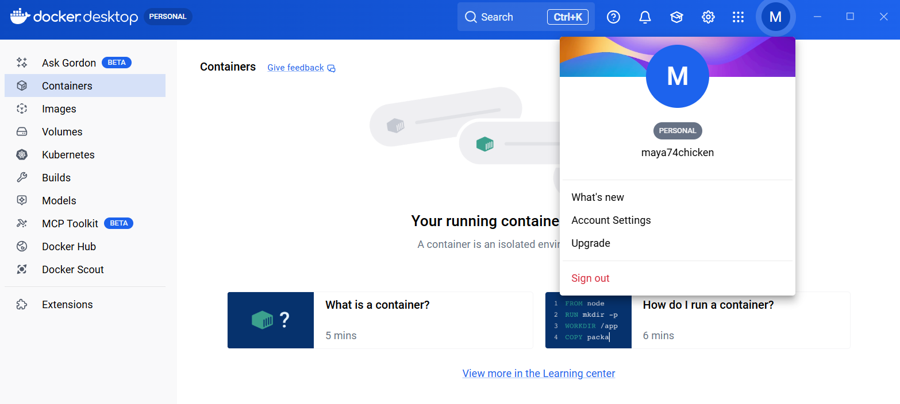
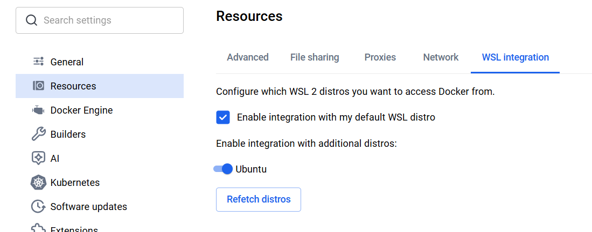
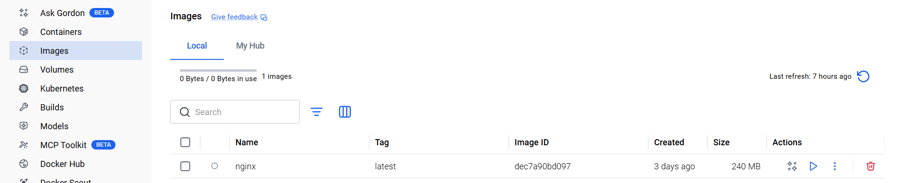
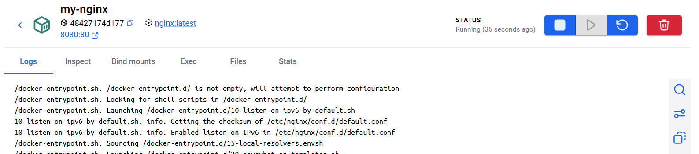
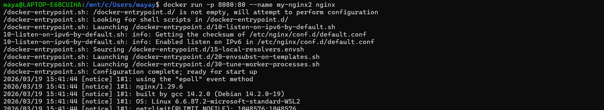

# Docker 講習

Web開発の現場では、環境構築やアプリケーションの実行を効率化するために、仮想化技術の一つであるDockerを使うことが多くあります。

---

# 目次

---

1. **Dockerについて**

   1-1. Dockerとは

   1-2. 仮想化技術

2. **環境構築**

   2-1. Docker Desktop のインストール

   2-2. DockerでWebサーバを立ててみる

3. **Web開発における Docker の使い方**

   3-1. 概観

   3-2. Dockerfile

   3-3. compose.yaml

   3-4. Docker のCLIまとめ

   3-5. （おまけ）発展知識

---

## 1. Docker について

## 1-1. Docker とは

アプリケーションの実行環境（ソースコード、ライブラリなど）を、**コンテナ**という単位でパッケージ化し、同じ開発環境を用意するためのもの。

- チーム開発で使われているNodeのバージョンが、手元のものと違って動かない...

- 本番環境を完全に再現した状態で開発したい

という問題を解消すべく、

- OSの設定

- ライブラリのバージョン

- ミドルウェア（DB, Redis）

などの**環境ごとパッケージ化**して配るイメージ。仮想化技術の一つ。

## 1-2. 仮想化技術

::: warning
System班の内容なので、読み飛ばしても構いません！→ `2. 環境構築`に進みましょう。
:::

### コンピュータのレイヤー

1. **アプリケーション**：作ったアプリ、書いたソースコードなど
2. **ユーザーランド**：シェル（`bash`, `zsh`）、ライブラリ（`glibc`）
3. **OS（カーネル）**：ハードウェアの管理＋読み書き、PCのプロセスの制御
4. **ハードウェア**：CPU、メモリ、入出力

Docker は、OS の上で動き、ユーザーランドから上を構成する。

→ Docker コンテナの実体は、自分のOSが作るプロセスの一つ。

::: tip

OSの**プロセス**とは

コンピュータの「実行中のプログラム」のこと。Chromeを起動する、VSCodeを起動する、コマンドを実行する、など。

これらは、見かけ上は同時に実行されているように見えるが、実際にはCPUの担当が高速に切り替わり（**コンテキストスイッチ**）、各プロセスが実行されている。

Windowsは「タスクマネージャー」、Macは「アクティビティモニタ」というアプリで、OSが実行中のプロセス・それらのCPU/メモリ使用量を確認したり、それらを強制終了させたりすることができる。

:::

### 仮想化技術の２種類

- ハイパーバイザ型（VMware, VirtualBox）

  `Type1` ハードウェア → ハイパーバイザ → ゲストOS

  `Type2` ハードウェア → ホストOS → ハイパーバイザ → ゲストOS

- コンテナ型（Docker）

  ホストOSのカーネルを使い、その上にコンテナ（ユーザーランドのプロセス）を立てる。

::: tip
Docker Desktop の内部では、ハイパーバイザ型仮想化で Linux VM が起動され、そのLinux上で、Dockerおよびコンテナが動いている。

ハードウェア → ホストOS → Linux VM → Dockerコンテナ

:::

### 仮想化技術の使用例

- マイクロサービス
  - 認証・投稿・決済などのサービスを別コンテナにする。
  - 違う言語・環境でもok。部分障害にも強い。

- CI/CD（Continuous Integration / Continuous Delivery）
  - DevOpsの基盤（解析→ビルド→テスト→デプロイ）。開発環境を共通化する。

- クラウド
  - 物理サーバを仮想マシンで分離し、ユーザごとに環境を隔離する。

- セキュリティ
  - サンドボックスでテストする。

---

## 2. 環境構築

## 2-1. Docker Desktop のインストール

1. Docker Desktop のインストール

   https://docs.docker.com/get-started/get-docker/

   自分のOSおよびCPUアーキテクチャに合わせて、インストーラーをダウンロードする。

2. PCの再起動（自動）

3. Docker Subscription Service Agreement で `Agree` を押す

4. アカウント登録（ブラウザに飛ぶ）

   `Personal` で新規作成し、メール認証を行う。

5. サインインした状態で、Docker Desktop のアプリに飛ぶ

   

6. **WSL連携をON**（Windowsの方向け）

   `Settings` > `Resources` > `WSL integration` で `Ubuntu` をONにし、右下の `Apply & restart` を押す。

   

7. Docker が入ったか確認

   ターミナル / コマンドプロンプト>`wsl` を開き、

   ```
   $ docker --version
   ```

   を入力し、バージョン情報が出れば OK。

   例）

   ```
   $ docker --version
   Docker version 28.1.1-rd, build 4d7f01e
   ```

## 2-2. DockerでWebサーバを立ててみる

Docker Desktop のGUIを使って、Nginxコンテナを立てる。

::: tip
**Webサーバ**

①クライアントからHTTPリクエストを受け取り、②HTMLなどの静的ファイルを返すコンピュータのこと（バックエンド入門1 を参照）。
:::

### 流れ

1. nginxイメージを取得
2. それを元にコンテナを作る
3. nginxプロセス（コンテナ）を起動
4. ブラウザからnginxサーバにアクセス

::: tip
**Dockerイメージ**

Dockerコンテナを作る（環境を丸ごと再現する）ための設計図。
:::

### 手順

1. 左メニュー `Images` > 検索バーに `nginx` と入力

2. nginx を `Pull`

   

3. nginxイメージの右にある再生ボタン`Run`を押す

4. `Container name`、`Host port`（8080:80 の 8080 の方）を入力し、`Run`を押す

   → コンテナが作られる（下写真）

   

5. ブラウザで、`http://localhost:8080` にアクセスし、`Welcome to nginx!` が表示される

### 以上の一連の流れを CLI でやる

基本的な書き方：**`$ docker run -p <ポート番号> --name <コンテナ名> <イメージ名>`**

ターミナル / コマンドプロンプト > `wsl` で、

```
$ docker run -p 8080:80 --name my-nginx nginx
```

を実行し、ブラウザで `http://localhost:8080` にアクセスする。



::: warning
先ほどの`my-nginx`コンテナを削除するか、コンテナ名が衝突しないようにする。

**ポート競合**（＝使用しようとしているポートを、既に他のプロセスが占有している状態）にも注意。
:::

---

## 3. Web開発における Docker の使い方

## 3-1. 概観

バックエンド入門2 の「掲示板」を、Docker上で動かすことを考える。

前：`$ php -S localhost:8000` でPHPのビルトインWebサーバを立てていた

後：`$ docker compose up --build` で実行環境を構築する（開発PCのOSによる差異↓）

### コンテナの構成例

1. nginx（**Webサーバ**、HTTPを受け取り、php-fpmに転送する。）
2. php-fpm（**APサーバ**、PHPを実行する。イメージは**Dockerfile**で定義する。）
3. mysql（**DBサーバ**）

これらのコンテナを、`$ docker compose up` で一気に起動できるようにする。

## 3-2. Dockerfile

Dockerイメージをビルドするための設定を書く。

::: tip
「イメージをビルドする」とは

Dockerfileを上から順に実行し、実行結果の状態を積み重ねていくこと。
:::

Dockerfile では、上から順に環境を組み立て、最後に何を実行するか書く。

```Dockerfile
FROM php:8.2-fpm
# 既存のイメージを土台にする

WORKDIR /var/www/html
# コンテナ内の作業ディレクトリを決める

COPY . .
# ローカルのファイルをコンテナに入れる。「.」は現在のディレクトリを表す。

RUN docker-php-ext-install pdo pdo_mysql
CMD ["php-fpm"]
```

- `RUN`

  イメージのビルド時に実行するコマンド。

  パッケージのインストール、ライブラリの追加など。

- `CMD`

  コンテナの起動時に実行するコマンド。

使用例）

```Dockerfile
RUN npm install
CMD ["node", "index.js"]
```

今回の3コンテナでは、`php-fpm`のイメージはDockerfileで自作し、`nginx`と`mysql`のイメージは既存のものを利用する。

## 3-3. compose.yaml

まとめて複数のコンテナを動かす際、その構成や、起動方法を書く。

今回は、Web（`nginx`）、AP（`php-fpm`）、DB（`mysql`）の3コンテナを動かすので、

```yml
services:
  db: ...
  php: ...
  nginx: ...

volumes:
  db_data:
```

という書き方になる（各コンテナの`...`の部分は後述）。

### DBサーバ（mysql）

```yml
db:
  image: mysql:8.0
  environment:
    MYSQL_ROOT_PASSWORD: root
    MYSQL_DATABASE: bulletin_board
  volumes:
    - db_data:/var/lib/mysql
    - ./schema.sql:/docker-entrypoint-initdb.d/schema.sql:ro
  ports:
    - "3306:3306"
```

- **ボリューム** ＝ コンテナ内のデータを永続化させる仕組み。Dockerが管理する領域(named volume)、またはホストのディレクトリ(bind mount) にデータを保存する。

- ローカルの `db_data` ディレクトリを、コンテナ内では `/var/lib/mysql` と表すとする

::: tip
一般的に **`<ホストのリソース>:<ゲストのリソース>`** と書く。
:::

### APサーバ（php-fpm）

```yml
php:
  build: .
  environment:
    DB_HOST: db
    DB_NAME: bulletin_board
    DB_USER: root
    DB_PASS: root
  volumes:
    - .:/var/www/html
  depends_on:
    - db
```

- 使用するイメージは、既存イメージではなく、**Dockerfile で自作したもの**なので、`image`ではなく`build`で指定する。

- `depends_on` は起動順序の制御。`db`を先に起動（起動完了までは保証しない）。

### Webサーバ（nginx）

```yml
nginx:
  image: nginx:alpine
  ports:
    - "8080:80"
  volumes:
    - .:/var/www/html
    - ./nginx.conf:/etc/nginx/conf.d/default.conf:ro
  depends_on:
    - php
```

### コンテナの起動

本来の流れは、

1. イメージをビルド `$ docker build`
2. コンテナを起動 `$ docker run`

これらをまとめて、

```
$ docker compose up --build
```

で実行できる。

- `$ docker compose build`, `$ docker compose up` の2回に分けても良い。

- Dockerfile を更新していない・既存のイメージがある場合は `$ docker compose up` だけで良い。

- 起動だけならGUIが楽（Docker Desktopの各コンテナの再生ボタンを押すだけ）。

## 3-4. Docker のCLIまとめ

::: info
Docker Desktop の GUI が便利。
:::

- **Dockerfile からイメージを作成する**

  `docker build [オプション] <Dockerfileのパス>`

  ex. `docker build -t imagename/nginx：latest .`

- **DockerHub からイメージを取得する**

  `docker pull [オプション] <imagename>`

- **自作イメージを DockerHub にアップロードする**

  `docker push [オプション] <imagename>`

- **Dockerイメージからコンテナを立てる**

  `docker run [オプション] <imagename>`

  ex. `docker run --name httpdcontainer -d -p 8080:80 httpd`

  `--name`：コンテナ名指定

  `-d`：バックグラウンド実行

  `-p`：コンテナのポート番号とサーバのポート番号を紐付ける

- **Dockerコンテナを起動/停止させる**

  `docker start/stop [オプション] <containername>`

- **起動中のコンテナの中に入る**（← 重要！コンテナ内のシェルでコマンドを打てる）

  `docker exec -it <コンテナ名> <シェル名>`

  `-it`：対話モード

## 3-5. （おまけ）発展知識

### `.dockerignore`の設定

Dockerイメージのビルドコンテキストを軽くするための仕組み。

- Git系（`.git`, `.gitignore`）
- 高速化（`node_modules`, `dist`）

などを含める。`$ docker compose build` 実行時、

1. Docker CLI が、指定されたディレクトリをビルドコンテキストとして収集する
2. `.dockerignore` に従って不要ファイルを除外する
3. それをDockerデーモンに送る
4. Dockerfile が、そのコンテキストを元に `COPY` などを実行する

### イメージビルド時のキャッシュ

コードを変更したのに反映されない...（Dockerfile, 外部依存のパッケージなど）

→ Docker イメージがビルドされる（＝ Dockerfile が上から1行ずつ実行される）とき、ビルドの**キャッシュ**が使われているかも。

解決策：

1. イメージのビルド時に、キャッシュを使わないようにする

   `$ docker compose build --no-cache`

2. ビルド時のキャッシュを削除する

   `$ docker builder prune`

---

## お疲れさまでした！

Dockerむずかしい。。。けどWeb開発では当たり前の存在です！

開発で実際に使いながら、慣れていきましょう！（・ω・　）
