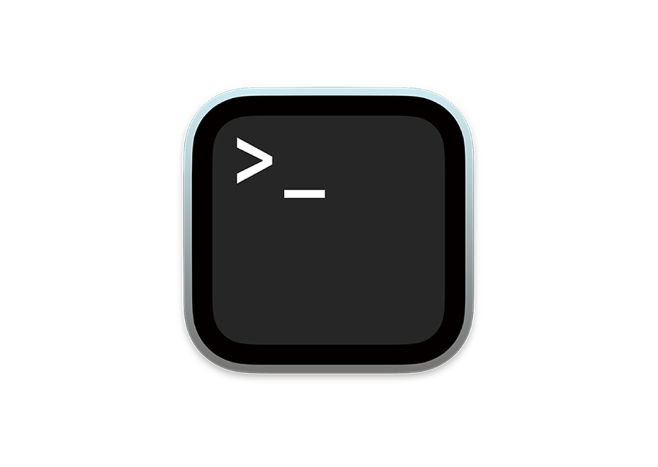
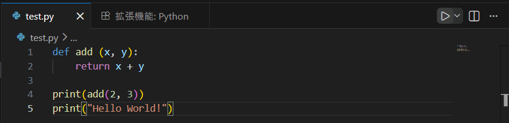

# Web班へようこそ！

骨なしチキン

---

# 目次

0. 自己紹介
1. Web班の活動内容について
2. CLI に慣れる
3. 開発環境（コードエディタ）の構築

---

# 0. 自己紹介！

---


---


---


---

# 1. Web班の活動内容

---

1. 開発環境の構築 ◀︎
2. フロントエンド入門（HTML/CSS）
3. フロントエンド実践（Next.js, React）
4. Git/GitHub講習
5. バックエンド入門１（PHPでログイン処理）
6. Docker講習
7. バックエンド入門２（PHPで掲示板）
8. バックエンド実践（FastAPIで掲示板）

- この辺りで、エンジニアのインターンに参加してみるのがオススメです（KCSの先輩が紹介してくださいます）

`入門`は仕組みの理解、`実践`はフレームワークを用いて自分でコードを書く、というイメージです。

---

（ここからは動的に決めます。**太字**は絶対やりたい）

- **チーム開発**（去年は学祭サイトだった。もっと社会に貢献できるサービスもよし。アイデア募集中）
- デプロイ体験
- 色んなWebフレームワークを触ってみる
- **Webデザイン**（UI/UXを学ぶ、CSSをきわめる）
- アーキテクチャ、ソフトウェア工学
- **バックエンドの発展的な技術**（キャッシュ戦略で高速化、非同期/並列処理、分散システム、etc...）
- Webセキュリティ（CTFで実践的に）
- 自作ブラウザ（そろそろシステム班になってきてまずい）

---

今はAIが秒でWebサイトを作ってくれて、Web学ぶ意味ある？となるのですが、

- 上流工程（システムの設計、方向性の決定）で現実的な判断ができるようになる
- AIを使う側になれる
- 趣味として楽しい

のようなメリットがあると思っています。（・ω・　）

私はほんとうに初心者ですが、プログラミングは好きなので、Web班のみんなで知見を共有しあえたら嬉しいです！！

---

# 2. CLI に慣れる

---

# 2-1. CLI とは

画面操作ではなく文字で、コンピュータに命令をする。シンプルに便利。

- GUI（Graphical User Interface）
  ボタンをクリックしたり、アイコンをドラッグしたりして、画面操作する。

- **CLI**（Command Line Interface）
  上記の操作を、文章（コマンド）で行う。
  `$ mkdir test && cd test`＝ testフォルダを作ってそこに移動する

---

# 2-2. コマンドはどこで打つ？



1. Linux / Mac
   ターミナル（シェルは bash / zsh）。

2. Windows
   コマンドプロンプト（cmd.exe）、PowerShellなど。

シェル（コマンドを解釈するプログラム）によって、コマンドの文法が異なる...

---

# 2-3. bash系が世界標準

- Mac の方
  ターミナルの中で動いている zsh は bash の上位互換なので大丈夫です。

- Windows の方
  WSL（Windows Subsystem for Linux）を入れる。Windows の上で Linux OS を動かすもの。

---

# 2-4. WSL 環境構築手順（Windowsの方向け）

1. コマンドプロンプトを管理者として開く（アプリのアイコンを右クリック）
2. `$ wsl --install` を実行

   

3. Windows を再起動

---

4. コマンドプロンプトを開き、`$ wsl --set-default-version 2` を実行

5. `$ wsl --install -d Ubuntu` で Ubuntu ユーザの設定

   

   ※ 設定した ユーザ名 / パスワード を忘れずに！

6. 今後は、コマンドプロンプトで `$ wsl` を実行し、Linux 環境で開発を行う。

---

# 2-5. 基本的なLinuxコマンド

| コマンド | 意味             | 例               | 説明                     |
| -------- | ---------------- | ---------------- | ------------------------ |
| `ls`     | ファイル一覧表示 | `ls -la`         | ディレクトリの中身を見る |
| `cd`     | ディレクトリ移動 | `cd /home/user`  | フォルダを移動する       |
| `pwd`    | 現在地表示       | `pwd`            | 今いるディレクトリを確認 |
| `cp`     | コピー           | `cp a.txt b.txt` | ファイルをコピー         |
| `mv`     | 移動 / 名前変更  | `mv a.txt b.txt` | ファイル移動 or リネーム |
| `rm`     | 削除             | `rm file.txt`    | ファイルを削除           |
| `cat`    | 中身表示         | `cat file.txt`   | ファイルの内容を表示     |

---

Windowsの方はコマンドプロンプト>`wsl`で、Macの方はターミナルで、CLI操作に慣れてみましょう。


---

# 2-6. Web開発に必要なコマンドのインストール

## パッケージ管理の更新

（WSL）`sudo apt update && sudo apt upgrade -y`
（Mac）`brew update && brew upgrade`


※ `password` には、2-4で設定したWSLユーザのパスワードを入力

---

## Node.js 環境構築

Node.js（＝JavaScript実行環境）を入れる。JavaScriptの実行には V8エンジン が必要で、ブラウザやNode.jsがそれを持っている。

1. `nvm`（Nodeの管理）のインストール
   `$ curl -o- https://raw.githubusercontent.com/nvm-sh/nvm/v0.39.7/install.sh | bash`

2. シェルの設定ファイル（`~/.bashrc`, `~/.zshrc`）を読み直して反映
   （WSL）`$ source ~/.bashrc`
   （Mac）`$ source ~/.zshrc`
   または、ターミナルの再起動

3. Node.js のインストール `$ nvm install --lts`

---

# 3. 開発環境（コードエディタ）の構築

---

## Visual Studio Code とは

Web開発時は、Microsoftが提供する無料のソースコードエディタ「Visual Studio Code」を利用する。

エディタ、ターミナル、Git関連ツール、デバッガ、コード補完など、快適な開発環境を提供してくれる。

## インストール手順

1. https://code.visualstudio.com/Download
   から、自分のOSに合わせてインストーラーをダウンロード

2. インストーラーを実行し、指示に従ってインストール

---

## 日本語にする（任意）

1. 拡張機能（左バーの一番下）で `Japanese Language Pack` と検索

   

2. インストールし、VSCode を再起動

   

---

## コード整形してくれるやつ

1. 拡張機能 > `Prettier - Code formatter` をインストール

2. `Cmd + Shift + P` で、`setting.json`と入力し、「ユーザー設定を開く（JSON）」を選択

3. 開いたファイルに、下記を入力
   ```JSON
   {
     "editor.formatOnSave": true,
     "editor.defaultFormatter": "esbenp.prettier-vscode"
   }
   ```

---

## Pythonを動かしてみる

1. ターミナルで、
   （WSL）`$ sudo apt install python3`
   （MAC）`$ brew install python3`

2. 拡張機能 > `Python` をインストール

3. 右上の再生ボタンで実行
   

---

## ありがとうございました！

次回以降は、基本的なコードの書き方やWebの知識を学んでいきます。

興味のある言語やフレームワークを調べて触ってみたり、どんなサービスを作りたいか考えてみたりして、Discord でいろいろ共有しあいましょう！
