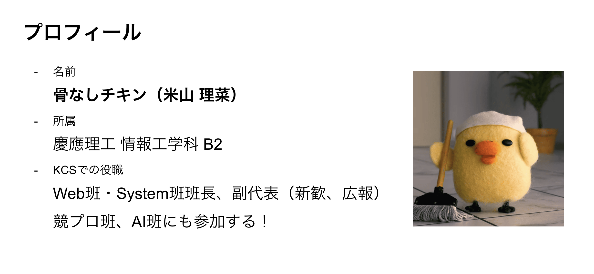
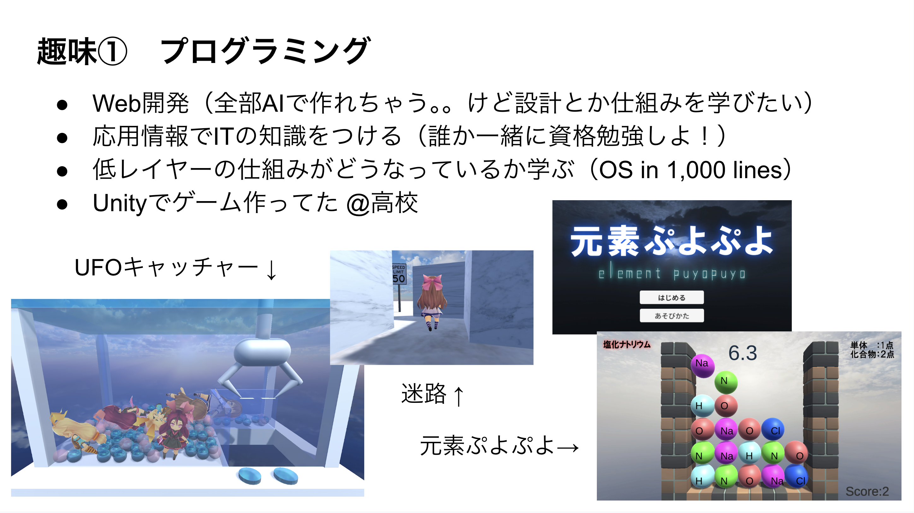
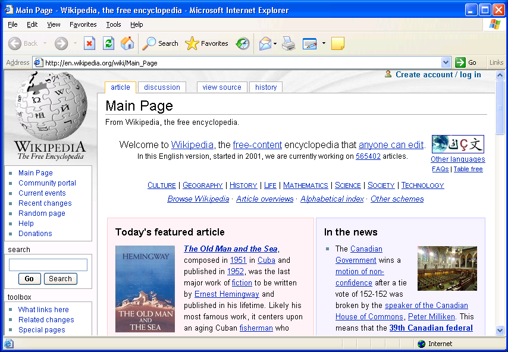
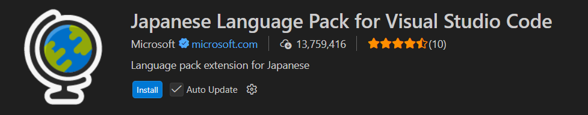
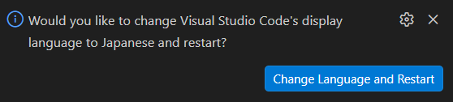
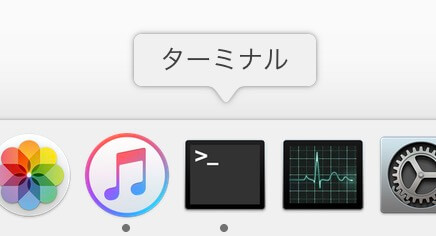
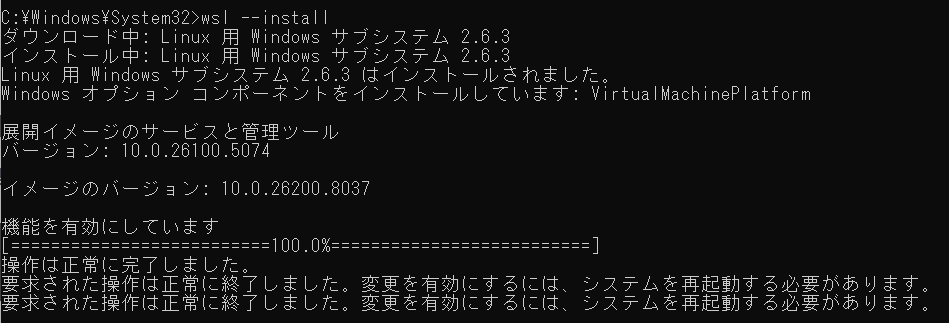
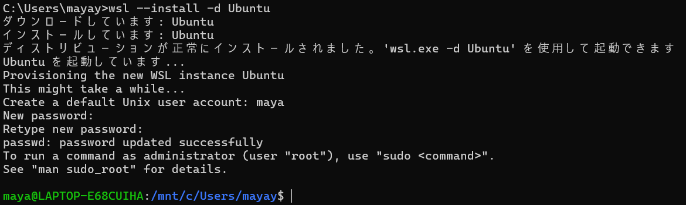
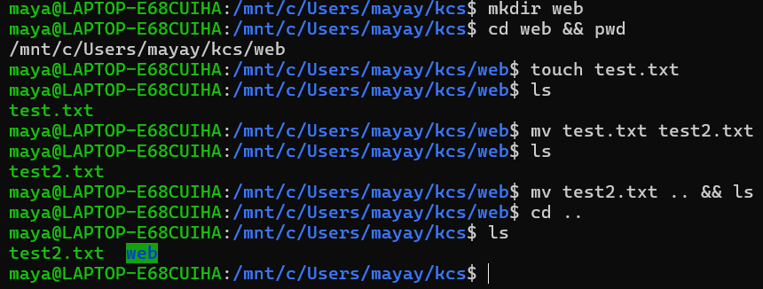
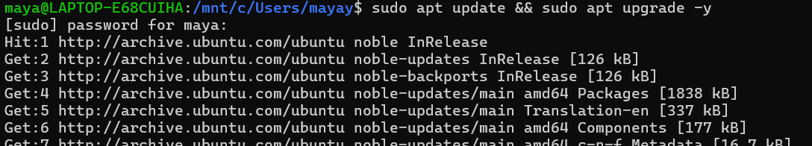

# KCS Web班へようこそ！

KCS :: Keio Computer Society は、慶應義塾大学で唯一、そして日本最古のコンピュータサークルです。「パソコン使って全部やる」をモットーに、Web・AI・System（低レイヤー）・競プロ・ゲーム・音楽・CG の７班に分かれて活動しています。

本記事は、2026年度 Web班の講習会資料です。

---

# 目次

---

1. **自己紹介**

2. **Web班について**

   2-1. 活動のモチベ

   2-2. 活動内容

3. **Web概論**

4. **開発環境の構築**

   4-1. Visual Studio Code とは

   4-2. インストール・環境構築

   4-3. VSCode ショートカットキーまとめ

5. **CLI に慣れる**

   5-1. GUI と CLI

   5-2. コマンドはどこで打つ？

   5-3. bash系が世界標準

   5-4. WSLの環境構築（Windowsの方向け）

   5-5. 基本的なLinuxコマンド

   5-6. Web開発でよく使うコマンドのインストール

---

## 1. 自己紹介






---

## 2. Web班について

## 2-1. 活動のモチベ

IT業界は、次のように大別されます。

> - インターネット/Web（ポータルサイト、ショッピングサイト、SNS）
> - ソフトウェア（業務アプリ、OS、ミドルウェア）
> - ハードウェア（PC、スマホ、ネットワーク機器、半導体）
> - 通信インフラ（通信キャリア、ISP）
> - 情報処理サービス（ITコンサルタント）

また、エンジニアの種類には、

> - 開発系
>   - フロントエンドエンジニア
>   - バックエンド（サーバーサイド）エンジニア
>   - システムエンジニア
> - インフラ系
>   - ネットワークエンジニア
>   - サーバーエンジニア
>   - セキュリティエンジニア
> - コンサル/マネジメント系
>   - プロジェクトマネージャー
>   - ITコンサルタント

のようなものがあります。

エンジニアとして働きたい、という漠然とした思いからプログラミングを学び始めると、私も含め、多くの人が次のような壁にぶつかります。

- インターンなどで実務経験を積みたい

- しかし大手企業のインターンに参加するには、ある程度の実務経験が求められる

- 一方でベンチャー企業のインターンは、教育体制が十分でない場合もある

- Web開発を独学しようとしても、何から手をつければよいのかわからない

そこで、エンジニアを目指し始めて同じ悩みを抱える方が、Web開発の基礎を体系的に学び、その後スムーズに実務経験のステップへとつなげていけるよう、本記事を執筆しています。

また、「今はAIがWebサイトを簡単に作ってくれるのに、わざわざWeb開発を学ぶ意味はあるのか？」という疑問に関しては、

- 仕組みを学ぶことで、より良い実装、迅速なデバッグができる

- AIに的確な指示を出せる（使われる側ではなく、使う側に回る）

- 上流工程（システムの設計、方向性の決定）で現実的な判断ができるようになる

- 作ること自体が楽しい

という理由で、学ぶ意義は十分にあると考えます。

私自身もまだ学習中の立場ですが、だからこそ同じ目線で、役立つ情報をまとめていければと思っています。

Web班のみんなで知見を共有しあえたら嬉しいです！！（・ω・　）ﾌｧ

## 2-2. 活動内容

1. **開発環境の構築** ◀︎

2. **フロントエンド入門** - おみくじを作る（HTML, CSS, JavaScript）

3. **フロントエンド実践** - ポートフォリオを作る（Next.js, React）

4. **Git/GitHub講習**

5. **バックエンド入門1** - ログイン機能を作る（PHP）

6. **バックエンド入門2** - 掲示板を作る（PHP, SQL）

7. **Docker講習**

8. **バックエンド実践** - 掲示板を作る（FastAPI）

::: tip

ここまで終えたあたりで、エンジニアの長期インターンに参加してみるのがオススメです。KCSの先輩が紹介してくださいます！

:::

（ここからは動的に決めます。**太字**は絶対やりたい）

- **チーム開発**（去年は三田祭サイトを開発した。もっと本格的なWebサービスを作るのも良き。アイデア募集中）
- **バックエンドの発展的な技術**（キャッシュ戦略で高速化、非同期/並列処理、分散システム、etc...）
- **アーキテクチャ、ソフトウェア工学**
- **Webデザイン**（UI/UXを学ぶ、CSSを完全に理解する）
- デプロイ体験
- 色んなWebフレームワークを触ってみる
- Webセキュリティ（DevSecOpsを考える、CTFで脆弱性を学ぶ）
- 自作ブラウザ（そろそろシステム班になってきてまずい）

---

## 3. Web概論

Webとは、Wordle Wide Web の略（世界規模のクモの巣）。インターネット上の情報をブラウザで見る仕組みのこと。

### ブラウザの歴史

ブラウザとは、URLを入力することでサーバからWebページを取得し、それを解釈し、表示するソフトウェア。

1. WorldWideWeb（1990）

   人類初のブラウザ。

2. **Internet Explorer**（1995）

   Microsoft社がWindowsに標準搭載し、2000年前後の主流となった。

   

3. **Safari**（2003）

   Apple社がMacに標準搭載した。iPhone（2007）とともに普及。

4. **Firefox**（2004）

   Mozilla Corporation社が開発。ブラウザの「タブ」という概念が生まれた。

5. **Google Chrome**（2008）

   超高速、安定。現在の主流。

6. **Microsoft Edge**（2015）

   IE の後継。2020年に、Chromiumベースに変更された。

::: tip

**Chromium**とは

Google社がオープンソースとして公開した、ブラウザを作る土台。Google Chrome や Microsoft Edge の内部で使われている。

:::

---

---

Webの導入はここまでです！

次章から、実践的な内容に入ります。頑張っていきましょう！

---

## 4. 開発環境の構築

## 4-1. Visual Studio Code とは

Web開発時は、Microsoftが提供する無料のソースコードエディタ「Visual Studio Code」を利用する。

エディタ、ターミナル、Git関連ツール、デバッガ、コード補完など、快適な開発環境を提供してくれる。

## 4-2. インストール・環境構築

1. https://code.visualstudio.com/Download

   から、自分のOSに合わせてインストーラーをダウンロード

2. インストーラーを実行し、指示に従ってインストール

### 日本語にする（任意）

1. 拡張機能（左バーの一番下）で `Japanese Language Pack` と検索

   

2. インストールし、VSCode を再起動

   

### コード整形してくれるやつ

1. 拡張機能 > `Prettier - Code formatter` をインストール

2. `Cmd + Shift + P` で、`setting.json`と入力し、「ユーザー設定を開く（JSON）」を選択

3. 開いたファイルに、下記を入力
   ```JSON
   {
     "editor.formatOnSave": true,
     "editor.defaultFormatter": "esbenp.prettier-vscode"
   }
   ```

---

## 4-3. VSCode ショートカットキーまとめ

最初の3個だけ覚えれば大丈夫！

| 操作内容                    | Windows / Linux                 | Mac               |
| --------------------------- | ------------------------------- | ----------------- |
| **ファイル保存**            | `Ctrl + S`                      | `Cmd + S`         |
| **元に戻す（Undo）**        | `Ctrl + Z`                      | `Cmd + Z`         |
| **Undoを元に戻す（Redo）**  | `Ctrl + Y` / `Ctrl + Shift + Z` | `Cmd + Shift + Z` |
| 全選択                      | `Ctrl + A`                      | `Cmd + A`         |
| コマンドパレット            | `Ctrl + Shift + P`              | `Cmd + Shift + P` |
| ファイル/ディレクトリを開く | `Ctrl + O`                      | `Cmd + O`         |
| 新規ファイル作成            | `Ctrl + N`                      | `Cmd + N`         |
| ページ内検索                | `Ctrl + Shift + F`              | `Cmd + Shift + F` |
| ページ内検索＋置換          | `Ctrl + Shift + H`              | `Cmd + Shift + H` |

---

## 5. CLI に慣れる

## 5-1. GUI と CLI

画面操作ではなく文字で、コンピュータに命令をする。シンプルに便利。

- **GUI**（Graphical User Interface）

  ボタンをクリックしたり、アイコンをドラッグしたりして、画面操作する。

- **CLI**（Command Line Interface）

  上記の操作を、文章（コマンド）で行う。

  `$ mkdir test && cd test`＝ testフォルダを作ってそこに移動する

## 5-2. コマンドはどこで打つ？



1. Linux / Mac

   ターミナル（シェルは bash / zsh）。

2. Windows

   コマンドプロンプト（cmd.exe）、PowerShellなど。

OSによってシェル（コマンドを解釈するプログラム）が異なり、コマンドの文法も異なる。

→ Linux が主流？

## 5-3. bash系が世界標準

- Mac

  ターミナルの中で動いている zsh は bash の上位互換。

- Windows

  **WSL**（Windows Subsystem for Linux）を入れる。

  Ubuntu などのLinuxディストリビューションを、Windows 上で直接実行できるようにする、軽量な仮想環境。

## 5-4. WSLの環境構築（Windowsの方向け）

::: warning
以降に出てくる`$ ...`は、`$`を含めず、文章のみをコピペして入力してください！
:::

1. コマンドプロンプトを**管理者として**開く（アプリのアイコンを右クリック）

2. wsl のインストール

   ```
   $ wsl --install
   ```

   

3. Windows を再起動

4. コマンドプロンプトを開き、以下を実行

   ```
   $ wsl --set-default-version 2
   ```

5. Ubuntu ユーザの設定

   ```
   $ wsl --install -d Ubuntu
   ```

   

   ::: warning
   ここで設定した ユーザ名 / パスワード を忘れずに！
   :::

6. 今後は、コマンドプロンプトで `$ wsl` を実行し、Linux 環境で開発を行う。

## 5-5. 基本的なLinuxコマンド

| コマンド | 意味             | 使用例           | 説明                     |
| -------- | ---------------- | ---------------- | ------------------------ |
| `ls`     | ファイル一覧表示 | `ls -la`         | ディレクトリの中身を見る |
| `cd`     | ディレクトリ移動 | `cd /home/user`  | フォルダを移動する       |
| `pwd`    | 現在地表示       | `pwd`            | 今いるディレクトリを確認 |
| `cp`     | コピー           | `cp a.txt b.txt` | ファイルをコピー         |
| `mv`     | 移動 / 名前変更  | `mv a.txt b.txt` | ファイル移動 or リネーム |
| `rm`     | 削除             | `rm file.txt`    | ファイルを削除           |
| `cat`    | 中身表示         | `cat file.txt`   | ファイルの内容を表示     |

Windowsの方はコマンドプロンプト>`wsl`で、Macの方はターミナルで、CLI操作に慣れましょう。



::: info

情報工学科2年の「コンピュータ実習」の授業で学びます！

:::

## 5-6. Web開発でよく使うコマンドのインストール

### パッケージ管理の更新

（WSL）`$ sudo apt update && sudo apt upgrade -y`

（Mac）`$ brew update && brew upgrade`



::: warning

WSLの `password for xxx` には、2-4で設定したWSLユーザのパスワードを入力する。Macは、ログイン時に使用しているパスワード。

:::

### Node.js 環境構築

Web開発でよく使う言語はJavaScript。それを使えるように、Node.js（＝JavaScript実行環境）を入れる。

::: tip
JavaScriptの実行には V8エンジン が必要で、ブラウザやNode.jsがそれを持っている。
:::

1. nvm（Nodeの管理）のインストール

   ```
   $ curl -o- https://raw.githubusercontent.com/nvm-sh/nvm/v0.39.7/install.sh | bash
   ```

2. シェルの設定ファイル（`~/.bashrc`, `~/.zshrc`）を読み直して反映

   （WSL）`$ source ~/.bashrc`

   （Mac）`$ source ~/.zshrc`

   または、ターミナルの再起動

3. Node.js のインストール
   ```
   $ nvm install --lts
   ```

---

## お疲れさまでした！

次回以降は、基本的なコードの書き方やWebの知識を学んでいきます。

興味のある言語やフレームワークを調べて触ってみたり、どんなサービスを作りたいか考えてみたりして、Discord でいろいろ共有しあいましょう！

## 参考文献

- WIKINEWS [File:Internet Explorer 6.png](https://en.wikinews.org/wiki/File%3AInternet_Explorer_6.png)
