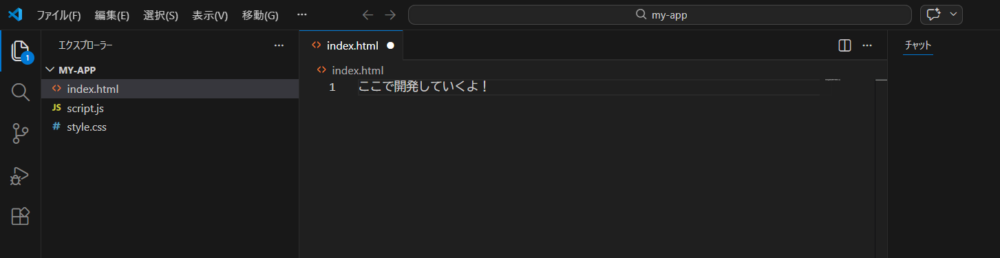
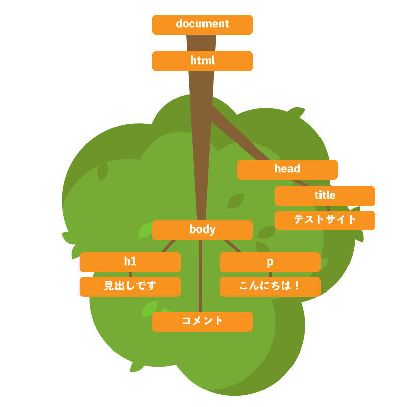
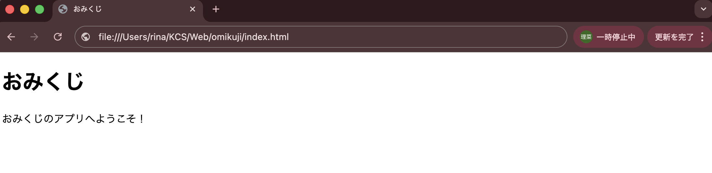
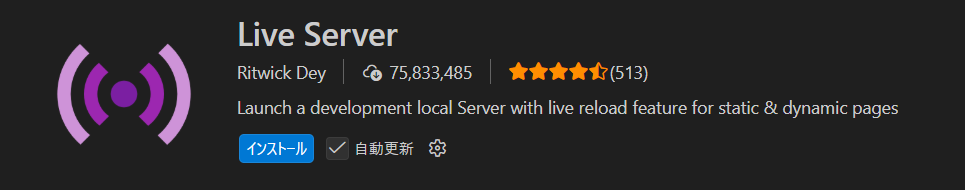
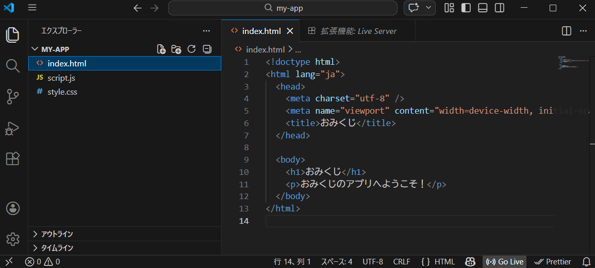
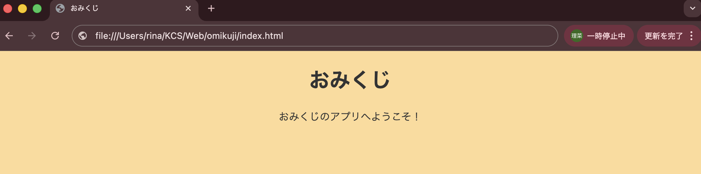
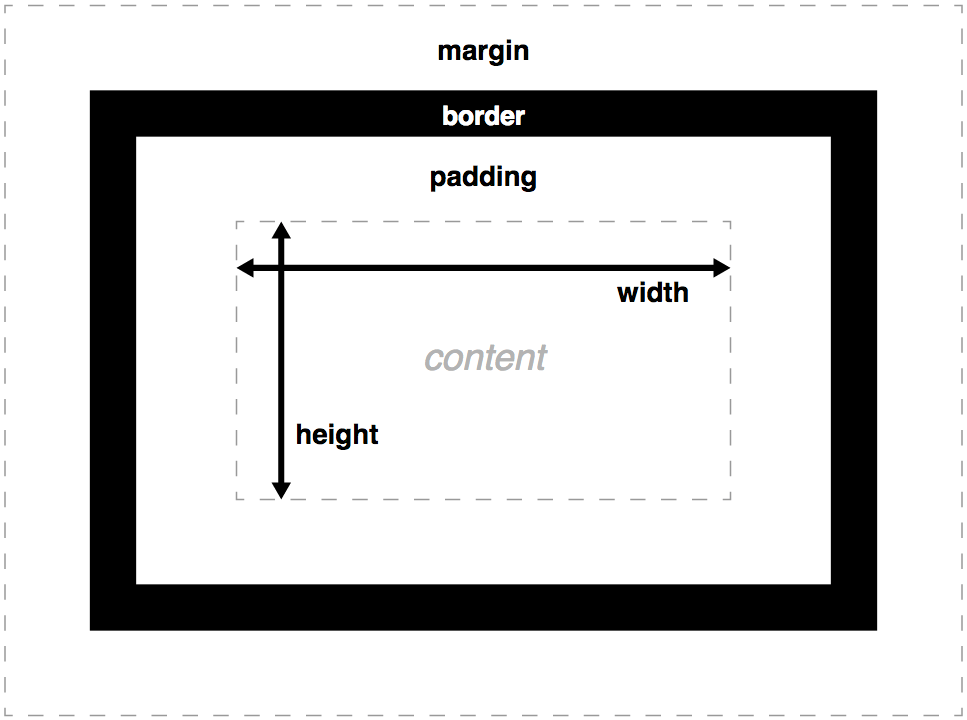
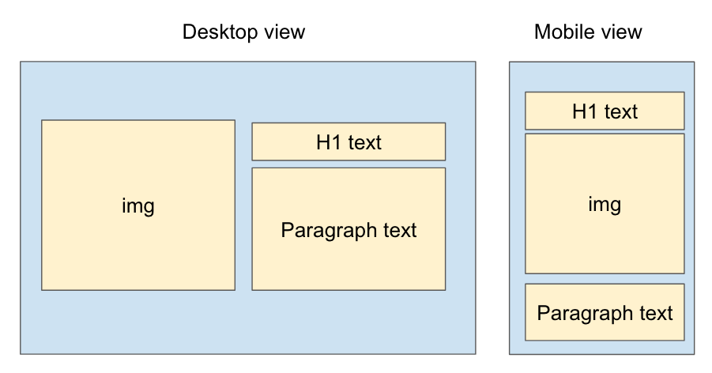
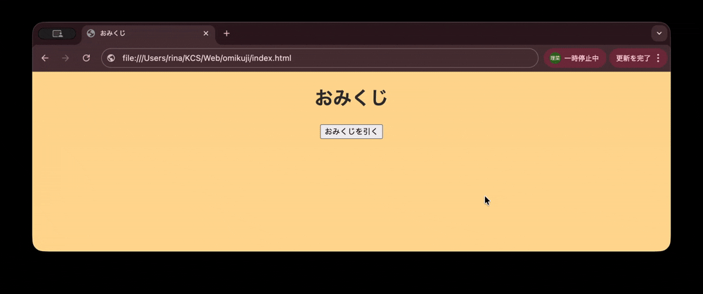
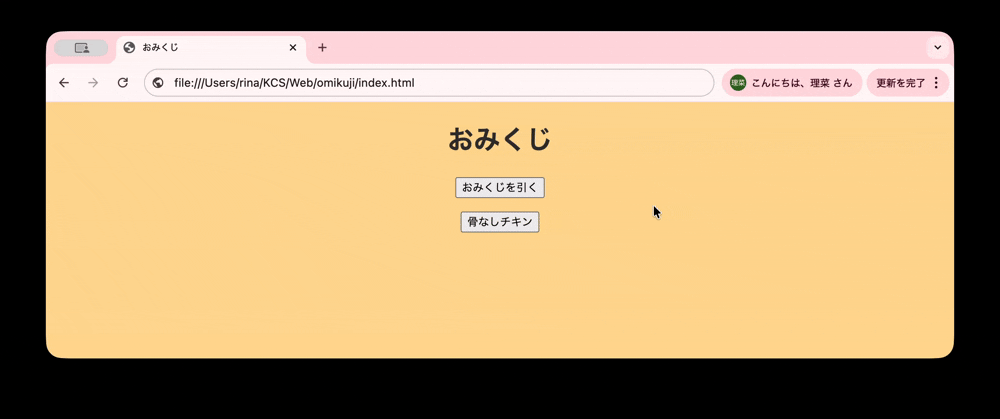

# フロントエンド入門 - おみくじを作る

[参考リポジトリ](https://github.com/74rina/omikuji)

Webブラウザ上で動作する HTML, CSS, JavaScript は、Webサイトの技術の基本です。

今回は、簡単なおみくじアプリを作りながら、書き方の基本を学びます。

詳しい文法は、[MDN(MDN Web Docs)](https://developer.mozilla.org/ja/) を適宜参照してください。

---

# 目次

---

1.  **HTML**（HyperText Markup Language）

    1-1. 環境構築

    1-2. HTMLファイルの雛形

    1-3. ブラウザがやっていること

    1-4. ブラウザで挙動確認

    1-5. localhost

2.  **CSS**（Cascading Style Sheets）

    2-1. 使用例

    2-2. 実装

    2-3. CSSの親子関係

    2-4. CSSプロパティまとめ

    2-5. CSSのC（Cascade）とは

3.  **JavaScript**

    3-1. JSのイベント管理

    3-2. オブジェクト指向

    3-3. JSの文法

4.  **演習**

---

## 1. HTML（HyperText Markup Language）

Webページの**構造**（骨組み）を作るための言語。見出し・文章・画像・リンクなど。

```html
<h1>タイトル</h1>
<p>これは文章です。</p>
<a href="https://example.com">リンク</a>
```

の形で記述する。

## 1-1. 環境構築

まず、以下のような構成で、ディレクトリを作成する。

```
my-app/
├── index.html
├── style.css
└── script.js
```

::: tip
前回学んだCLIを積極的に使ってみましょう！

ディレクトリを作る・・・`$ mkdir my-app`

そこに移動する・・・`$ cd my-app`

ファイルを作成する・・・`$ touch index.html`
:::

このディレクトリをVSCodeで開き、以下のように開発環境が整ったら完了。



::: info
VSCodeでディレクトリを開くときは、左上の`ファイル` > `フォルダーを開く` を押し、該当ディレクトリを選択する。
:::

## 1-2. HTMLファイルの雛形

`index.html`に、下記のコードを貼る。

```html
<!DOCTYPE html>
<html lang="ja">
  <head>
    <meta charset="utf-8" />
    <meta name="viewport" content="width=device-width, initial-scale=1" />
    <title>おみくじ</title>
  </head>

  <body>
    <h1>おみくじ</h1>
    <p>おみくじのアプリへようこそ！</p>
  </body>
</html>
```

メインページの名前として、`index.html`が標準。`https://example.com/`は本来、`https://example.com/index.html`のことである。

また、HTMLは、HTMLタグ`<xxx></xxx>`の集合である。

### 構造を示す系のタグ

- `<!DOCTYPE html>`

  「これはHTML5のファイルですよ」とバージョン情報をブラウザに伝える。

- `<meta charset="utf-8">`

  日本語の文字コードの指定。これがないと文字化けする。

- `<head>`

  画面には見えない設定。メタ情報、サイトのタイトル、CSSの情報など。

- `<body>`

  実際に画面上に表示する中身。

### テキスト系のタグ

- `<h1>`〜`<h6>`：見出し（h1が一番大きい）

- `<p>`：段落（普通の文章）

## 1-3. ブラウザがやっていること

1. HTMLファイルを受け取る
2. HTMLを上から読んでパースする
3. 2の途中で、CSSやJSなどの外部ファイルを見つけ、必要であれば取得する
4. DOM（後述）を作る
5. 画面を描画する
6. その後もJS実行や再描画が起こる

2のパースでは、**HTMLタグ**が主役。

ブラウザは、HTMLを上から順に読み、HTMLタグの意味を解釈しながら、**DOM**（Document Object Model）という構造を作る。

::: tip
**DOM**（Document Object Model）

HTMLを「ツリー構造（木構造）」として表現したもの。
:::



## 1-4. ブラウザで挙動確認

先ほどの`index.html`を、ブラウザで確認する際、2通りの方法がある。

1.  **HTMLファイルを開くだけ**

    Windowsは「エクスプローラー」、Macなら「Finder」で、`index.html`のファイル自体をダブルクリックすると、ブラウザに飛ぶ。

    

2.  **ローカルでWebサーバ（後述）を立てる**

    VSCodeの拡張機能「Live Server」をインストールする。

    

    その後、編集画面に行き、右下の `Go Live` を押す。

    

3.  `Server is Started at port: 5500` と表示されるので、ブラウザで `http://localhost:5500` にアクセスする。

## 1-5. localhost

インターネットにおいて、「クライアント（ブラウザ）↔︎ Webサーバ」の通信が基本。

ex.) Googleにアクセスする時：ブラウザ ↔︎ Googleのサーバ

### IPアドレスとドメイン名

- **IPアドレス**

  インターネット上で、サーバの場所を示す住所（`142.250.xxx.xxx`）。

- **ドメイン名**

  人間が覚えやすい、名前の住所（`google.com`, `x.com`）。

- **DNS**（Domain Name System）

  ドメイン名とIPアドレスを変換する仕組み。**DNSサーバ**が、対応関係（**レコード**と呼ばれる）を管理している。

### localhostとは

自分自身（自分のPC）を指す特別な名前。対応するIPアドレスは `127.0.0.1`。

このアドレスとの通信はネットワーク（LAN）の外に出ないため、**開発用サーバ**に利用する。

---

## 2. CSS（Cascading Style Sheets）

HTMLにデザインをつけるための言語。HTML要素の色や文字サイズ、余白、レイアウト、アニメーションなどを設定できる。

```css
.要素名 {
  プロパティ名: 値;
}
```

の形で記述する。

## 2-1. 使用例

以下のHTML要素にデザインを加えることを考える。

```html
<div class="greet">こんにちは</div>
```

次のようにCSSを定義することで、スタイルを当てることができる。

```css
.greet {
  background: white;
  padding: 20px;
}
```

とすることでデザインを追加できる。

## 2-2. 実装

先ほどのHTMLの`<head>`内に、以下を追加し、ページのレンダリング前にCSSを読み込ませる。

```html
<head>
  <meta charset="utf-8" />
  <title>おみくじ</title>
  ...
  <link rel="stylesheet" href="style.css" />
</head>
```

これに対し、以下のように`style.css`を作成する。

```css
body {
  margin: 0;
  background: orange;
  color: #333;
  text-align: center;
}
```



## 2-3. CSSの親子関係

`1-3. ブラウザがやっていること` の通り、HTMLは木構造（**親子関係**）を持っている。CSSでは、このHTML要素の親子関係が重要。

一部のCSSプロパティは、親から子へ**継承**（inherit）される。例えば、

```html
<div class="parent">
  骨なしチキン
  <p class="child1">Hello World!</p>
  <p class="child2">from egg</p>
</div>
```

というHTMLに対し、

```css
.parent {
  color: red;
}
```

のように親要素にCSSを当てると、その子要素にも文字色が適用される。

::: tip
継承されるプロパティは、だいたいテキスト関連（color, font-size, font-familyなど）。
:::

## 2-4. CSSプロパティまとめ

### 見た目（色・大きさ）系

要素の色、枠線、影などを設定できる。継承されない。

```css
{
  background-color: #f5f5f5;

  border: 1px solid #ccc;

  border-radius: 8px; /*要素の角を丸くする*/

  box-shadow: 0 2px 8px rgba(0,0,0,0.1);
}
```

CSSは、`<p>Hello World!</p>` などの文字に適用されているように見えるが、すべてのHTML要素は

- 中身（文字）を持った「**四角い箱**」

であることに注意する。

この箱に対して、下図のように、height（高さ）、width（幅）、border（箱の枠線）などの値を定義できる。



::: tip

**RGB + A**

赤（Red）、緑（Green）、青（Blue）の3色に、不透明度を表す「アルファチャンネル（Alpha）」を加えたカラーモデル。

:::

### テキスト系

HTML要素の中の文字に対して、適用される。継承されるので、親に一回書けば良い。

```css
{
  color: red;
  font-size: 16px;
  font-family: "Noto Sans JP"; /*フォント*/
  font-weight: bold; /*太字*/
  text-align: center; /*文字の位置（後述）*/
  line-height: 1.6; /*行間隔*/
}
```

例えば、

```html
<div class="greet">Hello</div>
```

```css
.greet {
  width: 200px;
  text-align: center;
}
```

の場合、`greet`要素は**画面の中央には見えない**。**「200pxの箱」に対して中央**ということ。

### レイアウト系

親が、子要素の並び方を決めるときに使用する。継承されない。



以下のようなプロパティを、親要素のCSSに書く。

```css
{
  display: flex; /*子要素が横並びになる*/

  justify-content: center; /*子要素の、横方向の位置を決める*/

  align-items: center; /*子要素の、縦方向の位置を決める*/

  gap: 10px; /*子同士の間隔*/
}
```

## 2-5. CSSのC（Cascade）とは

階段状に連なる小さな滝のこと。ITにおいては、「上から順に影響していく」的な意味。

```css
body {
  color: red;
}
p {
  color: blue;
}
```

上記のように複数のCSSが重なったとき、スタイルは上から順に適用されていくので、`p`は`blue`になる。

---

## 3. JavaScript

Webページに「動き」をつける言語。今回は、おみくじを引くボタンを実装する。



### 手順

```html
<body>
  <h1>おみくじ</h1>
  <button id="button">おみくじを引く</button>
  <p id="result"></p>
  <script src="script.js"></script>
</body>
```

`id`とは、HTML要素につける一意の名前。これを用いて、JSからDOM操作を行える。

以下のように`script.js`を作成する（文法は後述）。

```js
document.getElementById("button").addEventListener("click", () => {
  const results = ["大吉", "中吉", "小吉", "吉", "凶"];
  const r = Math.floor(Math.random() * results.length);
  document.getElementById("result").textContent = results[r];
});
```

## 3-1. JSのイベント管理

クリックされた、ページが読み込まれた、などの事実を **イベント** と呼ぶ。

ブラウザは、イベントの発生を常時監視している。

イベント発生時の処理を書いておくのが`addEventListener`。基本的な書き方は

```js
<要素名>.addEventListener("イベント名", function() {
    押されたときの処理
});
```

このイベント管理の方法は、次の2通り。

1. HTMLにイベントを書く

   ```html
   <button onclick="draw()">引く</button>

   <script>
     export function draw() { ... }
   </script>
   ```

2. JSでイベントを管理する（拡張性↑）

   ```js
   element.addEventListener("click", draw);
   ```

   上記の `element` はHTMLから取得する。HTML要素に `id=xxx` と指定しておき、JSで

   ```js
   document.getElementById("xxx");
   ```

   として取得する。

## 3-2. オブジェクト指向

- **オブジェクト**

  ①データ（**プロパティ**）、②それを操作する処理（**メソッド**）がセットになった実体。

- **クラス**

  オブジェクトを生成するための「設計図」。これが「型」であることが多い。

- **インスタンス**

  クラスに基づいて作られた、具体的なオブジェクト。

クラスからインスタンスオブジェクトを作り、これらを組み合わせてプログラムを構築するのがオブジェクト指向。

- **プロパティ**（属性）：オブジェクトが持つ**データ**。

- **メソッド**：オブジェクトが持つ処理。

```js
// クラスを作る
class User {
  constructor(name) {
    this.name = name; // プロパティ（データ）の定義
  }

  // メソッド（処理）の定義
  greet() {
    console.log("Hello " + this.name);
  }
}

const user = new User("Taro"); // インスタンスオブジェクトを作る
user.greet(); // そのメソッドにアクセス
```

例えば、先ほどの

```js
document.getElementById("xxx");
```

では、`document`オブジェクトが`getElementById`のメソッドを持っているとわかる。

JSは標準で`document`オブジェクトを用意しており、このメソッドでHTML内の要素を操作できる。

## 3-3. JSの文法（暗記不要）

---

## 4. 演習

### クリックするたびに「骨なしチキン」→「骨つきチキン」と文字が変わるボタンを作りましょう！



### 実装のヒント

前述の「条件分岐」を適切に使う。

### 実装例

- HTMLに`button`要素を追加する。

  ```html
  <button id="chicken">骨なしチキン</button>
  ```

- JSで、`id`が`chicken`である要素を取得し、それに対しイベント処理を追加する（`addEventListener`）。

  ```js
  document.getElementById("chicken").addEventListener("click", () => {
    const el = document.getElementById("chicken");
    el.textContent =
      el.textContent === "骨なしチキン" ? "骨つきチキン" : "骨なしチキン";
  });
  ```

---

## お疲れさまでした！

Web開発の基本である HTML, CSS, JavaScript の書き方を学びました。

次回は、Webフレームワークを使って実際に開発を行いますが、実務においても JavaScript の理解は非常に重要です。

基礎をしっかり押さえながら、コーディング力を磨いていきましょう！

## 参考文献

- Stack Overflow [How can I change the layout and order of children with flexbox?](https://stackoverflow.com/questions/70591810/how-can-i-change-the-layout-and-order-of-children-with-flexbox)

- MDN [CSS box model](https://developer.mozilla.org/en-US/docs/Web/CSS/Guides/Box_model)

- MDN [Math.random()](https://developer.mozilla.org/ja/docs/Web/JavaScript/Reference/Global_Objects/Math/random)

- Zenn [何度調べてもわからないDOMに決着をつける](https://zenn.dev/antez/articles/b6eb22cb228a49)
