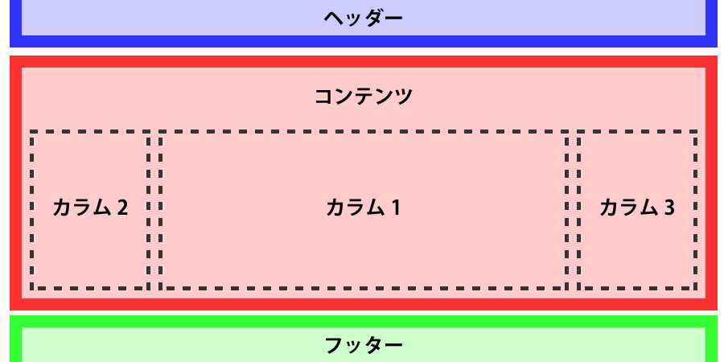
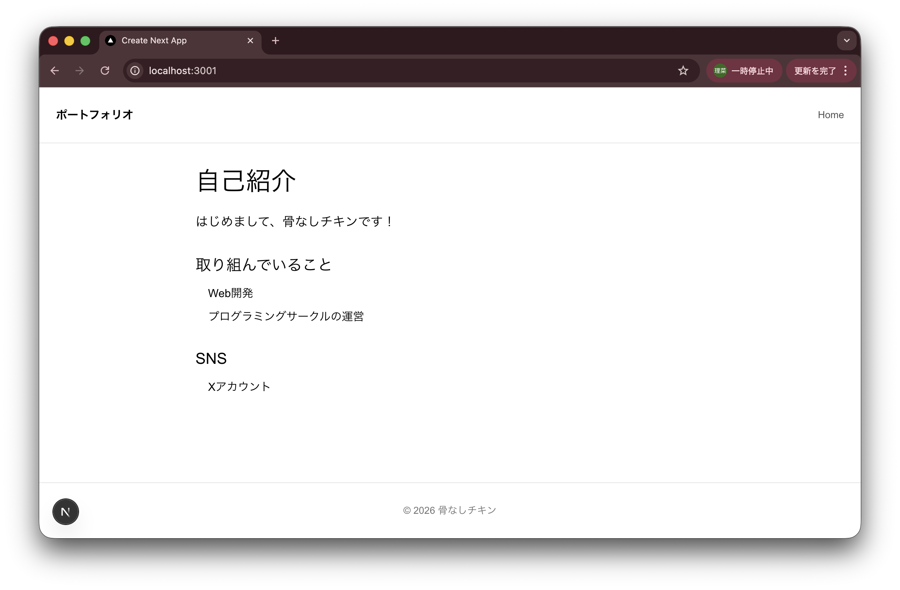
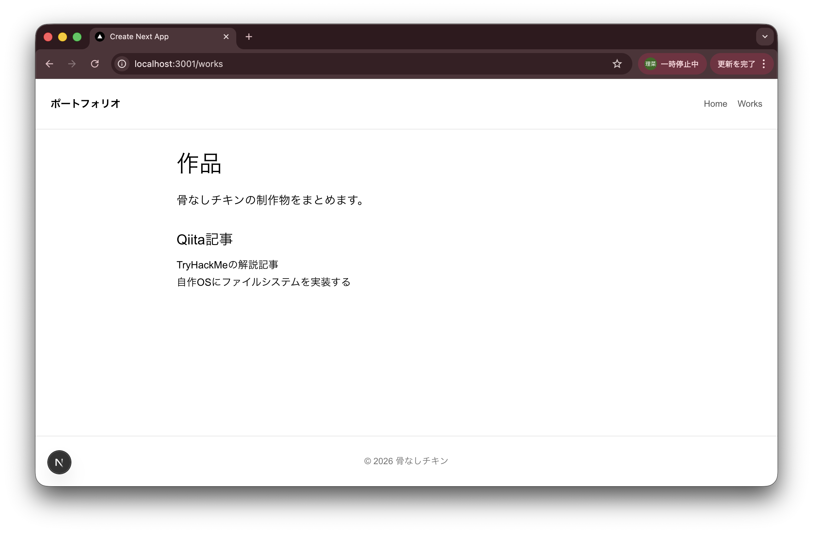
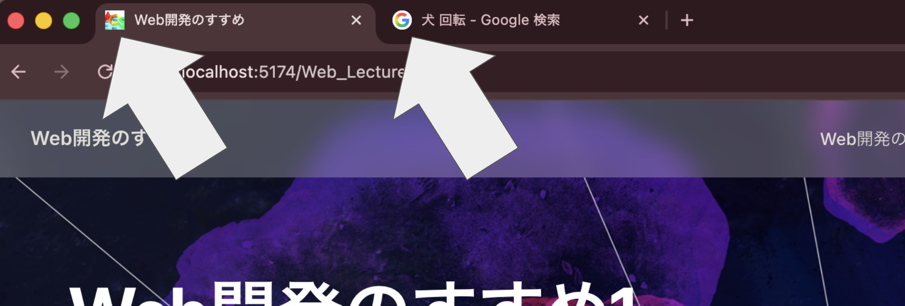

# フロントエンド実践 - ポートフォリオを作る

実際のWebサイトは、HTML, CSS, JavaScriptを直接書くだけでなく、Webフレームワークを利用して作られています。

今回は、JavaScriptフレームワークであるNext.jsと、UIを補完するReactライブラリを使って、自分だけのポートフォリオサイトを作っていきます。

---

# 目次

---

1.  **Next.js入門**

    1-1. Webフレームワークとは

    1-2. TypeScriptでの型定義

    1-3. Next.jsプロジェクトの作成

    1-4. 中身の実装

2.  **Next.jsの設計思想**

    2-1. ライフサイクルとは

    2-2. RSC（React Server Components）

3.  **実装**

    3-1. 画面全体の構成

    3-2. メインページの作成

    3-3. ヘッダー・フッターの作成

    3-4. ページを増やす

    3-5. faviconの設定

---

## 1. Next.js入門

## 1-1. Webフレームワークとは

Web開発に必要な機能が予めパッケージ化されたもの。さまざまなWebフレームワーク・ライブラリが生まれ、進化し続けている。

- フロントエンド系フレームワーク

  UIの更新、コンポーネント化、ルーティング、状態管理など。
  - Next.js（UIでReactを使用、言語はJavaScript/TypeScript）
  - Vue.js（JavaScript）

- バックエンド系フレームワーク

  DB接続、APIルーティング、セキュリティ対策（認証）など。
  - Django, Flask, FastAPI（Python）
  - Ruby on Rails（Ruby）
  - Laravel（PHP）
  - Express, NestJS（JavaScript/TypeScript）

::: tip

**フロントエンド**

ユーザから見える部分、操作性。ボタンのデザイン、アニメーション、フォームの入力チェックなど。

**バックエンド**

ユーザに見えない裏側の部分。実際の処理やデータ管理、認証など。

:::

## 1-2. TypeScriptでの型定義

Next.jsフレームワークを用いたフロントエンドの開発では、JavaScriptに**型**を追加した、**TypeScript**が使われることが多い。

::: warning
TypeScriptは、フレームワークではなく**言語**！
:::

### 「型」の重要性

**型**とは、コンピュータにデータの扱い方を教えるための、データが持つ性質のこと。整数型`int`、浮動小数点型`float`、文字列型`string`、真偽値`bool`など。

コンピュータの型付けの方法は、言語によって異なり、次の2種類に分けられる。

- **動的型付け**

  実行時に型が決まる。型を書かなくて良い。Python, JavaScriptなど。

  ```python
  x = 10
  x = "hello"
  ```

- **静的型付け**

  コンパイル時（実行前）に型が決まる。型を明示する必要があるが、コンパイル時にエラーを発見できる。TypeScript, Java, Cなど。

  ```js
  let x: number = 10;
  x = "hello"; // ←エラー
  ```

Web開発においては、次のような理由から型定義が重要である。

1. バグの早期発見

   静的型付けでは、型が壊れると**コンパイルエラー**になり、エラーの箇所を特定できるため、デバッグやリファクタリングが容易になる。

   動的型付けでは、実行時に初めて`Undefined`などのエラーが発生するため、バグの原因の特定が難しい。

2. 可読性/保守性の向上

   型を明示するため、変数や関数がどのようなデータを扱うのか明確になる（可読性↑）。これにより、他人や将来の自分がコードを理解しやすくなる（保守性↑）。

::: tip
**リファクタリング**

アプリケーションの外部から見た動作や機能を変えずに、内部のソースコードを整理・改善する作業。
:::

## 1-3. Next.jsプロジェクトの作成

1. Node.jsバージョン確認

   `$ node -v` で、Node.jsのバージョンが【20.11.1】以上であることを確認する。

   ::: warning
   Node.js をインストールしていない方は、[1.開発環境の構築](../environment/env.md)を参照してください。
   :::

2. Next.js関連のコマンドのインストール

   ```
   $ npm i -g create-next-app
   ```

   を実行して、Next.jsを立ち上げるためのコマンドをインストールする。

3. ターミナルで、プロジェクトのディレクトリを置く場所に移動

   ::: warning

   **WindowsでWSLを使用している方**

   Windows側のディレクトリ（`/mnt/c/...`）で、4のコマンドを実行すると非常に遅くなります。

   WSLのホームディレクトリに移動して（`$ cd ~`）、適当なディレクトリを作り、次に進みましょう。

   :::

4. アプリケーションの作成

   ```
   $ npx create-next-app@latest <プロジェクト名>
   ```

   を実行すると、Next.js製のアプリの雛形（Next.js + React + 設定済み環境）が作られる。

   

5. 開発用サーバ`localhost`の起動

   アプリのディレクトリ下（`/portfolio`）で、以下を実行する。

   ```
   $ npm run dev
   ```

   

   ::: tip

   ポート番号を自分で指定したい場合は、

   `$ npm run dev -- --port 3001`

   とする。

   :::

6. ブラウザで、`http://localhost:3000` にアクセスし、次の画面が表示されれば完了。

   

## 1-4. 中身の実装

VSCode で、先ほど作成した`portfolio`ディレクトリを開く。

::: tip

先ほどのターミナルで、/portfolio にいる状態で、

`$ code .`

を実行すれば、一発でVSCodeに飛べる。

:::

ブラウザで`localhost:3000`にアクセスした際に描画された画面のHTMLは、`app/layout.tsx`および`app/page.tsx`内に書かれている。


→ この中身を編集していく。

---

## 2. Next.jsの設計思想

Next.jsは、既存の**Reactという革命的なUIライブラリ**を使って、Webアプリケーションを開発できるようにした、フレームワークである。

:::tip
**UI**（User Interface）

Webアプリ・サービスと、ユーザーとを繋ぐ接点。つまり画面操作、ボタンや文字、そのデザインのこと。UIを通じて得られる「体験・使い心地」全体をUX（User Experience）という。
:::

- 2013年、旧Facebook社がReactライブラリを開発し、「**UIをコンポーネントで組む**」という概念が生まれた。

- 2016年、この設計思想をWebアプリ開発で実用化すべく、Vercel社がNext.jsフレームワークを開発した。

## 2-1. ライフサイクルとは

Webページにおける処理がどういう順番で進んで、どのタイミングで何が起こるか、という流れのこと。

一般的に、フロントエンドのライフサイクルは、次のようになる。

1. クライアントがリクエストを送信（URLが叩かれる）

2. サーバがレスポンスを返す（HTML, CSS, JS）

3. ブラウザが、HTMLをパースしてDOM生成

4. CSSを適用

5. レンダリング

6. JSが実行される

7. ユーザの操作によっては再レンダリング

これは、2〜6がクライアントが行われるため、①データ取得が遅い、②セキュリティ的にクライアントに寄っている、という問題点がある。

特に、「6. JSが実行される」においては

1. データ取得（`fetch`）
2. UI組み立て
3. イベント処理（クリックなど）
4. DOM更新

これら全てのロジックがクライアント側で実行されるため、データ取得の完了を待つ必要があり、初期表示が遅くなる。

## 2-2. RSC（React Server Components）

前述の問題を解消するため、Next.jsフレームワークは、Reactライブラリの思想を拡張＋実用化した。

- UI（状態）をコンポーネントで分割して管理する（Reactライブラリが持っていた思想）

- そのうち「データ取得＋UI生成」をサーバ側で実行する（Server Components）

- ブラウザは、**Client ComponentsのJS実行**、返ってきた**Server Componentsの表示**（JS実行は不要）、その他イベント処理をするだけ

というライフサイクルが実現した。

---

## 3. 実装

## 3-1. 画面全体の構成

一般的なWebページは、**ヘッダー**・**コンテンツ**・**フッター**で構成されている。

- ヘッダー：サイト名、ロゴ、ナビゲーションメニューなどを表示する領域

- コンテンツ：ページごとに内容が変わる中心部分

- フッター：コピーライト、問い合わせ先、補助リンクなどを表示する領域



画面遷移を伴うWebサイトでは、ヘッダーやフッターを**共通コンポーネント**として切り分け、複数ページで再利用する。

これにより、デザインを統一化しやすくなり、修正も1箇所で済むようになる。

## 3-2. メインページの作成

Next.js（React）においては、次のように、すべてのUIが**コンポーネント**（関数）として設計されている。戻り値にHTMLが書かれる。

```js
export default function xxx() {
   return ...
}
```

### JSの **export** とは

```js
const msg = "hello";
```

と変数を宣言したとき、これは他のファイルからは見えない。これを、

```js
// file.js

export const msg = "hello";
```

とすることで、

```js
// file2.js

import { msg } from "./file.js";

console.log(msg); // hello
```

のように外部ファイルで import して参照できるようになる。

export, import によって、**コンポーネントの依存関係**（＝ どこでどのコンポーネントを再利用するか）を管理できる。

### メインページのコンポーネントを編集

`app/page.tsx` の `Home()` 内を編集し、メインページを構築する。

```js
export default function Home() {
  return (
    <div className="intro-wrap">
      <h1 className="intro-title">自己紹介</h1>
      <p className="intro-lead">はじめまして、骨なしチキンです！</p>

      <section className="intro-section">
        <h2>取り組んでいること</h2>
        <ul className="intro-list">
          <li>Web開発</li>
          <li>プログラミングサークルの運営</li>
        </ul>
      </section>

      <section className="intro-section">
        <h2>SNS</h2>
        <ul className="intro-list">
          <li>
            <a href="https://x.com/74rina_">Xアカウント</a>
          </li>
        </ul>
      </section>
    </div>
  );
}
```

`className` で要素を指定し、そこに当てるCSSを`/app/globals.css`に書く。

```css
@import "tailwindcss";

body {
  color: var(--foreground);
  background: var(--background);
  font-family: Arial, Helvetica, sans-serif;
  margin: 0;
}

main {
  min-height: calc(100vh - 160px);
}

.intro-wrap {
  max-width: 760px;
  margin: 0 auto;
  padding: 24px 16px 64px;
  line-height: 1.7;
}

.intro-title {
  font-size: 36px;
  margin: 0 0 12px;
}

...
```

## 3-3. ヘッダー・フッターの作成

`app/layout.tsx` の `RootLayout()` 内を編集し、ヘッダー・フッターのコンポーネントとする。

```js
export default function RootLayout({
  children,
}: Readonly<{
  children: React.ReactNode;
}>) {
  return (
    <html lang="en">
      <body className={`${geistSans.variable} ${geistMono.variable} antialiased`}>
        <header className="flex h-20 items-center justify-between border-b border-neutral-200 px-6">
          <p className="text-base font-semibold">ポートフォリオ</p>
          <nav className="flex items-center gap-4 text-sm text-neutral-600">
            <a className="hover:text-neutral-900" href="/">
              Home
            </a>
          </nav>
        </header>

        <main>{children}</main>

        <footer className="flex h-20 items-center justify-center border-t border-neutral-200 px-6 text-sm text-neutral-500">
          <p>© 2026 骨なしチキン</p>
        </footer>
      </body>
    </html>
  );
}
```

- `className=" "` に直接CSSを書くことも可能（インラインスタイルシート）。

- `{children}` の中身には、`app/page.tsx` で **default export** したもの（今回は`Home()`）の戻り値が埋め込まれる。これはNext.jsの仕様。

つまり、次のようにページが構築されている。

```
<RootLayout>
   <Home />
</RootLayout>
```



## 3-4. ページを増やす

自己紹介の Home ページに加えて、作品を置く Works ページを作る。

`app/`配下に`works`というディレクトリを新規作成し、その中に`page.tsx`というファイルを作成する。その中に、Worksページのコンポーネントを次のように作成する。

```js
export default function WorksPage() {
  return (
    <div className="intro-wrap">
      <h1 className="intro-title">作品</h1>
      <p className="intro-lead">骨なしチキンの制作物をまとめます。</p>

      <section className="intro-section">
        <h2>Qiita記事</h2>
        <a href="https://qiita.com/74rina_/items/415208959e7616e427a6">
          TryHackMeの解説記事
        </a>
        <br></br>
        <a href="https://qiita.com/74rina_/items/b87fc9e7036a5cb30d77">
          自作OSにファイルシステムを実装する
        </a>
      </section>
    </div>
  );
}
```

また、ヘッダーに`Works`へのリンクを追加する。

```html
<a className="hover:text-neutral-900" href="/works"> Works </a>
```



## 3-5. faviconの設定

faviconとは、ブラウザのタブのアイコンのこと。



通常は、HTML内に

```html
<link rel="icon" href="favicon.ico" />
```

を追加することで設定できる。

今回は、Next.jsがデフォルトで`favicon.ico`の設定スクリプトを用意しているため、画像を差し替えるだけで良い。

### 拡張子 .ico

普通の画像（png, jpg）ではなく、アイコン用の拡張子。

- 複数のサイズ（16\*16, 32\*32など）を1ファイルに入れられる。状況に応じて最適なサイズを使ってくれる。

- 背景透過に対応。

などの機能を持つ。

---

## お疲れさまでした！

今回の成果物に対し、

- UI、Webデザインを凝ってみる

- CSSでアニメーションをつける

などの拡張を施し、ぜひ自分のポートフォリオサイトを公開してみましょう！

このような静的サイトは、[GitHub Pages](https://developer.mozilla.org/ja/docs/Learn_web_development/Howto/Tools_and_setup/Using_GitHub_pages) で簡単にデプロイすることができます。

## 参考文献

- Zenn「Next.jsの考え方」

  https://zenn.dev/akfm/books/nextjs-basic-principle/viewer/part_1
