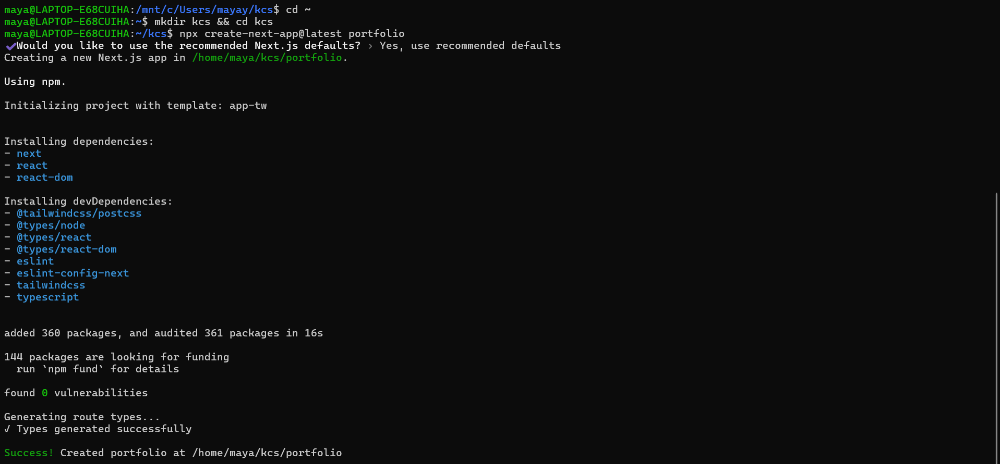
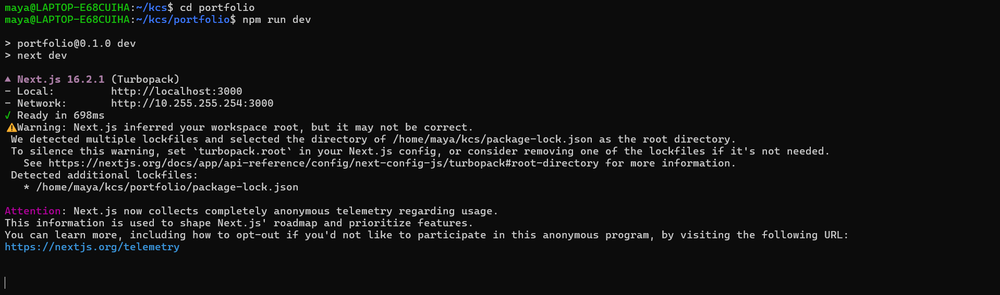
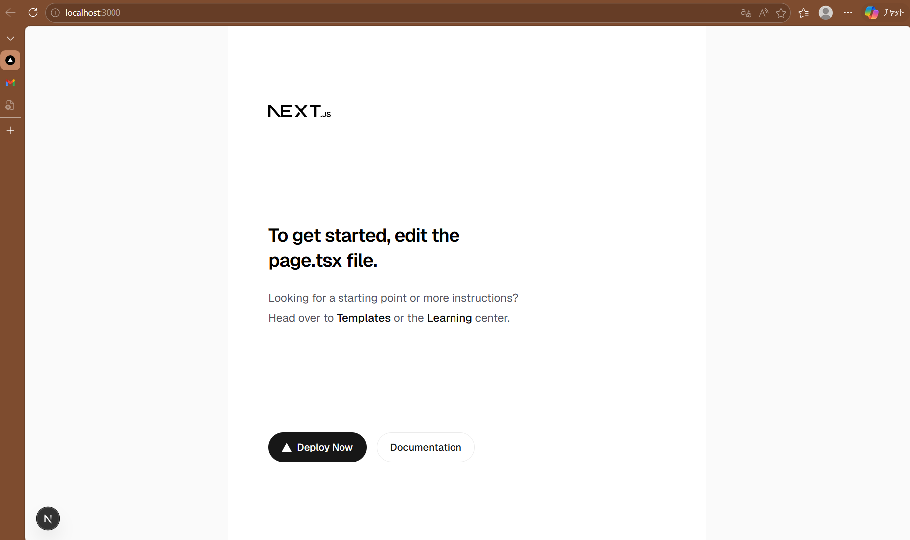
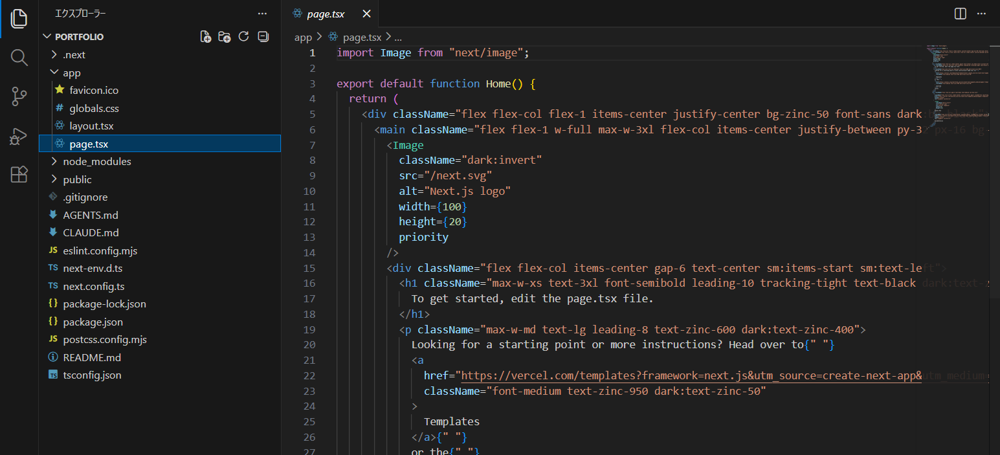

# フロントエンド実践 - ポートフォリオを作る

実際のWebサイトは、HTML, CSS, JavaScriptを直接書くだけでなく、Webフレームワークを利用して作られています。

今回は、JavaScriptフレームワークであるNext.jsと、UIを補完するReactライブラリを使って、自分だけのポートフォリオサイトを作っていきます。

---

# 目次

---

1.  **Next.js入門**

    1-1. Webフレームワークとは

    1-2. TypeScriptでの型定義

    1-3. Next.jsプロジェクトの作成

    1-4. 中身の実装

2.  **Next.jsの設計思想**

    2-1. ライフサイクルとは

    2-2. RSC（React Server Components）

3.  **実装**

4.  **読みやすいコードの書き方**

---

## 1. Next.js入門

## 1-1. Webフレームワークとは

Web開発に必要な機能が予めパッケージ化されたもの。さまざまなWebフレームワーク・ライブラリが生まれ、進化し続けている。

- フロントエンド系フレームワーク

  UIの更新、コンポーネント化、ルーティング、状態管理など。
  - Next.js（UIでReactを使用、言語はJavaScript/TypeScript）
  - Vue.js（JavaScript）

- バックエンド系フレームワーク

  DB接続、APIルーティング、セキュリティ対策（認証）など。
  - Django, Flask, FastAPI（Python）
  - Ruby on Rails（Ruby）
  - Laravel（PHP）
  - Express, NestJS（JavaScript/TypeScript）

::: tip

**フロントエンド**

ユーザから見える部分、操作性。ボタンのデザイン、アニメーション、フォームの入力チェックなど。

**バックエンド**

ユーザに見えない裏側の部分。実際の処理やデータ管理、認証など。

:::

## 1-2. TypeScriptでの型定義

Next.jsフレームワークを用いたフロントエンドの開発では、JavaScriptに**型**を追加した、**TypeScript**が使われることが多い。

::: warning
TypeScriptは、フレームワークではなく**言語**！
:::

### 「型」の重要性

**型**とは、コンピュータにデータの扱い方を教えるための、データが持つ性質のこと。整数型`int`、浮動小数点型`float`、文字列型`string`、真偽値`bool`など。

コンピュータの型付けの方法は、言語によって異なり、次の2種類に分けられる。

- **動的型付け**

  実行時に型が決まる。型を書かなくて良い。Python, JavaScriptなど。

  ```python
  x = 10
  x = "hello"
  ```

- **静的型付け**

  コンパイル時（実行前）に型が決まる。型を明示する必要があるが、コンパイル時にエラーを発見できる。TypeScript, Java, Cなど。

  ```js
  let x: number = 10;
  x = "hello"; // ←エラー
  ```

Web開発においては、次のような理由から型定義が重要である。

1. バグの早期発見

   静的型付けでは、型が壊れると**コンパイルエラー**になり、エラーの箇所を特定できるため、デバッグやリファクタリングが容易になる。

   動的型付けでは、実行時に初めて`Undefined`などのエラーが発生するため、バグの原因の特定が難しい。

2. 可読性/保守性の向上

   型を明示するため、変数や関数がどのようなデータを扱うのか明確になる（可読性↑）。これにより、他人や将来の自分がコードを理解しやすくなる（保守性↑）。

::: tip
**リファクタリング**

アプリケーションの外部から見た動作や機能を変えずに、内部のソースコードを整理・改善する作業。
:::

## 1-3. Next.jsプロジェクトの作成

1. Node.jsバージョン確認

   `$ node -v` で、Node.jsのバージョンが【20.11.1】以上であることを確認する。

   ::: warning
   Node.js をインストールしていない方は、[1.開発環境の構築](../environment/env.md)を参照してください。
   :::

2. Next.js関連のコマンドのインストール

   ```
   $ npm i -g create-next-app
   ```

   を実行して、Next.jsを立ち上げるためのコマンドをインストールする。

3. ターミナルで、プロジェクトのディレクトリを置く場所に移動

   ::: warning

   **WindowsでWSLを使用している方**

   Windows側のディレクトリ（`/mnt/c/...`）で、4のコマンドを実行すると非常に遅くなります。

   WSLのホームディレクトリに移動して（`$ cd ~`）、適当なディレクトリを作り、次に進みましょう。

   :::

4. アプリケーションの作成

   ```
   $ npx create-next-app@latest <プロジェクト名>
   ```

   を実行すると、Next.js製のアプリの雛形（Next.js + React + 設定済み環境）が作られる。

   

5. 開発用サーバ`localhost`の起動

   アプリのディレクトリ下（`/portfolio`）で、以下を実行する。

   ```
   $ npm run dev
   ```

   

   ::: tip

   ポート番号を自分で指定したい場合は、

   `$ npm run dev -- --port 3001`

   とする。

   :::

6. ブラウザで、`http://localhost:3000` にアクセスし、次の画面が表示されれば完了。

   

## 1-4. 中身の実装

VSCode で、先ほど作成した`portfolio`ディレクトリを開く。

::: tip

先ほどのターミナルで、/portfolio にいる状態で、

`$ code .`

を実行すれば、一発でVSCodeに飛べる。

:::

ブラウザで`localhost:3000`にアクセスした際に描画された画面のHTMLは、`app/layout.tsx`および`app/page.tsx`内に書かれている。



→ この中身を編集していく。

---

## 2. Next.jsの設計思想

Next.jsは、既存の**Reactという革命的なUIライブラリ**を使って、Webアプリケーションを開発できるようにした、フレームワークである。

:::tip
**UI**（User Interface）

Webアプリ・サービスと、ユーザーとを繋ぐ接点。つまり画面操作、ボタンや文字、そのデザインのこと。UIを通じて得られる「体験・使い心地」全体をUX（User Experience）という。
:::

- 2013年、旧Facebook社がReactライブラリを開発し、「**UIをコンポーネントで組む**」という概念が生まれた。

- 2016年、この設計思想をWebアプリ開発で実用化すべく、Vercel社がNext.jsフレームワークを開発した。

## 2-1. ライフサイクルとは

Webページにおける処理がどういう順番で進んで、どのタイミングで何が起こるか、という流れのこと。

一般的に、フロントエンドのライフサイクルは、次のようになる。

1. クライアントがリクエストを送信（URLが叩かれる）

2. サーバがレスポンスを返す（HTML, CSS, JS）

3. ブラウザが、HTMLをパースしてDOM生成

4. CSSを適用

5. レンダリング

6. JSが実行される

7. ユーザの操作によっては再レンダリング

これは、2〜6がクライアントが行われるため、①データ取得が遅い、②セキュリティ的にクライアントに寄っている、という問題点がある。

特に、「6. JSが実行される」においては

1. データ取得（`fetch`）
2. UI組み立て
3. イベント処理（クリックなど）
4. DOM更新

これら全てのロジックがクライアント側で実行されるため、データ取得の完了を待つ必要があり、初期表示が遅くなる。

## 2-2. RSC（React Server Components）

前述の問題を解消するため、Next.jsフレームワークは、Reactライブラリの思想を拡張＋実用化した。

- UI（状態）をコンポーネントで分割して管理する（Reactライブラリが持っていた思想）

- そのうち「データ取得＋UI生成」をサーバ側で実行する（Server Components）

- ブラウザは、**Client ComponentsのJS実行**、返ってきた**Server Componentsの表示**（JS実行は不要）、その他イベント処理をするだけ

というライフサイクルが実現した。

---

## 3. 実装

ポートフォリオサイトのイメージとしては、以下。

- 画面全体の構成（header, body, footer, navi）

- 自己紹介ページを作る
  - コンポーネント思考（ヘッダ、フッタを共通化）

- 「作品置き場」のページを増やす

- favicon入れる

---

## 4. 読みやすいコードの書き方

---

## お疲れさまでした！

今回の成果物に対し、

- UI、Webデザインを凝ってみる

- CSSでアニメーションをつける

などの拡張を施し、ぜひ自分のポートフォリオサイトを公開してみましょう！

このような、フロントエンドだけの静的なサイトは、[GitHub Pages](https://developer.mozilla.org/ja/docs/Learn_web_development/Howto/Tools_and_setup/Using_GitHub_pages) で簡単にデプロイすることができます。

## 参考文献

- Zenn「Next.jsの考え方」

  https://zenn.dev/akfm/books/nextjs-basic-principle/viewer/part_1
